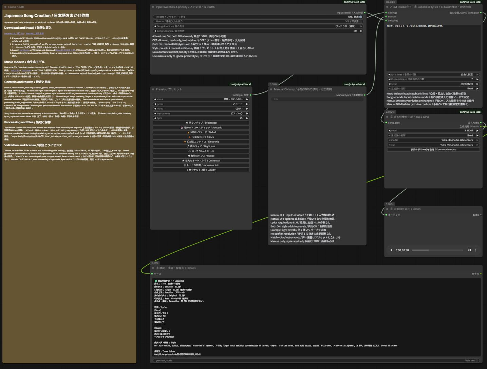
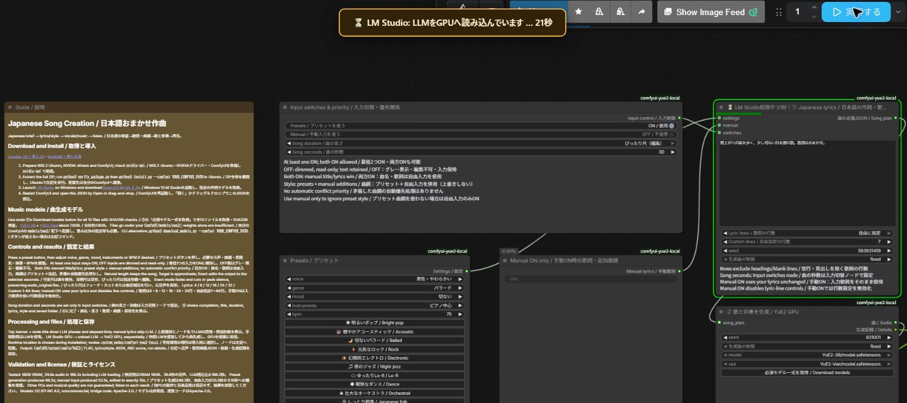

# Japanese Song Creation / 日本語おまかせ作曲 — LM Studio × YuE2 / ComfyUI

[Download this release / この版をダウンロード](https://github.com/FURUYAN1234/ComfyUI-YuE2-Japanese/releases/tag/v1.3.0)

[Installer ZIP / 導入用ZIP](https://github.com/FURUYAN1234/ComfyUI-YuE2-Japanese/releases/download/v1.3.0/YuE2_Japanese_LMStudio_v1.3.0.zip) · [Workflow JSON / ワークフローJSON](https://github.com/FURUYAN1234/ComfyUI-YuE2-Japanese/releases/download/v1.3.0/YuE2_Japanese_LMStudio.json)

Install the complete ZIP first; the JSON is also provided separately for importing after setup. / 初回はZIP一式を導入し、環境構築後の読込用にJSONも単独配布しています。


Enter a casual Japanese request; LM Studio writes Japanese lyrics and musical style, then YuE2 generates vocals and accompaniment. / 日本語で気軽に希望を入力すると、LM Studioが日本語の歌詞と曲調を作り、YuE2が歌と伴奏を生成します。

This local setup combines LM Studio on Windows with ComfyUI and an isolated YuE2 environment in WSL. / WindowsのLM Studioと、WSL内のComfyUI・独立したYuE2環境を組み合わせるローカル構成です。

**This package targets YuE2-3B; legacy YuE v1 models and installation instructions are different. / 対象はYuE2-3Bで、旧YuE v1向けのモデル・導入手順とは異なります。**

YuE2 models use CC BY-NC 4.0 for noncommercial use; check the [official repository](https://github.com/multimodal-art-projection/YuE) and model licenses. / YuE2モデルはCC BY-NC 4.0の非商用ライセンスなので、[公式リポジトリ](https://github.com/multimodal-art-projection/YuE)と各モデルの条件を確認してください。



This image is captured from the final workflow in ComfyUI, with no personal paths or private input included. / この画像は完成したワークフローをComfyUIで撮影したもので、個人のパスや私的な入力は含めていません。

## LLM startup and progress / LLMの起動・進行表示

A centered banner and the lyric node title show the current LLM phase and elapsed seconds, using the same presentation as the MiniMax H3 workflow. / MiniMax H3ワークフローと同じ形式で、画面上部中央の通知と作詞ノード名にLLMの処理段階・経過秒数を表示します。

The display follows queue acceptance, startup/connection, GPU loading, lyric generation, GPU release and completion. / 実行受付、起動・接続確認、GPU読込、作詞、GPU解放、完了の順に表示します。

Manual lyrics skip the LLM; cached lyrics explicitly show that no LLM startup is needed. / 手動歌詞ではLLMを省略し、キャッシュ再利用時はLLMの起動がないことを表示します。

LLM completion means lyrics are ready; song completion is shown separately in the results node. / LLMの完了は作詞完了を意味し、曲の完成は結果ノードで別に表示します。

Errors and interruptions stop the timer; a lost connection is shown as an unknown state. / エラーや中断ではタイマーを止め、接続断では処理状態が未確認であることを表示します。



## Package contents and separate requirements / 配布物と別途必要なもの

| Item / 同梱物 | Purpose / 用途 |
|---|---|
| `workflows/*.json` | ComfyUI workflow with one guide, presets, free input and execution nodes / 説明1枠・プリセット・自由入力・実行ノードのComfyUIワークフロー |
| `custom_nodes/comfyui-yue2-local/` | One package containing input control, preset, free-input, planning and generation nodes / 入力切替・プリセット・自由入力・作詞・曲生成のノードを含む1パッケージ |
| `runtime/` | LM Studio integration and YuE2 subprocess code / LM Studio連携とYuE2子プロセスの実行コード |
| `install.py` | Install the isolated environment, nodes and workflow / 専用環境・ノード・ワークフローの配置 |
| `models.json`, `download_models.py` | Pinned downloads and SHA256 checks for 13 files / 13ファイルの固定取得先とSHA256検査付き取得 |
| `verify_package.py`, `SHA256SUMS.json` | Detect missing, changed and extra package files / 配布内容の欠落・変更・余分なファイルを検出 |
| `docs/note-article.md`, `docs/assets/` | Article draft, workflow screenshot and thumbnail / 記事原稿・ワークフロー画像・サムネイル |

**Loading the JSON alone is insufficient; extract and install the entire ZIP. / JSONだけを読み込んでも動かないため、ZIP全体を展開して導入してください。**

Weights, LM Studio, ComfyUI, generated songs and credentials are not bundled. / モデル、LM Studio、ComfyUI、生成曲、認証情報は同梱していません。

No paid external API key is required; initial software and model downloads need internet access. / 外部の有料APIキーは不要で、初回のソフト・モデル取得にはインターネット接続を使います。

## Tested environment / 動作確認した環境

- Windows and WSL2 Ubuntu, NVIDIA GeForce RTX 5080 16GB. / WindowsとWSL2 Ubuntu、NVIDIA GeForce RTX 5080 16GB。
- Existing ComfyUI in WSL, with a separate Python 3.12.3 venv for YuE2. / WSL内の既存ComfyUIと、YuE2専用のPython 3.12.3独立venv。
- YuE2: PyTorch 2.10.0+cu128, CUDA 12.8; sm_120 support verified on the actual GPU. / YuE2側はPyTorch 2.10.0+cu128、CUDA 12.8で、sm_120対応を実機確認。
- LM Studio: Qwen3.5 9B Q4_K_M, maximum GPU offload, context 4096. / LM StudioはQwen3.5 9B Q4_K_M、GPU最大オフロード、コンテキスト4096。
- Unquantized YuE2-3B and YuE2-Vae, pinned official source, standard 32-step generation. / 非量子化YuE2-3BとYuE2-Vae、固定した公式ソース、通常の32ステップ生成。

These are successful short-song measurements on 16GB VRAM, not minimum requirements guaranteed for every GPU or song length. / これは16GBで短い曲を生成できた実例であり、すべてのGPUや曲の長さを保証する最低要件ではありません。

Allow tens of GB of free storage for approximately 7.8GB of YuE2 model files, the LLM, Python environments and downloads. / 約7.8GBのYuE2モデルファイルに加えてLLM・Python環境・ダウンロード領域が必要なので、数十GBの空き容量を用意してください。

## 1. Prepare Windows and WSL / WindowsとWSLを準備

Reuse a working WSL ComfyUI installation; you do not need to replace its Python or Torch to match this guide. / WSL内のComfyUIが動作していれば再利用でき、この説明に合わせて既存のPythonやTorchを入れ替える必要はありません。

For a fresh setup, install the [Windows NVIDIA driver](https://www.nvidia.com/Download/index.aspx) and follow [Microsoft's WSL guide](https://learn.microsoft.com/windows/wsl/install). / 新規の場合は[Windows用NVIDIAドライバー](https://www.nvidia.com/Download/index.aspx)を導入し、[MicrosoftのWSL導入手順](https://learn.microsoft.com/windows/wsl/install)に従ってください。

Run this Ubuntu 24.04 installation example in administrator PowerShell. / 次のUbuntu 24.04導入例は管理者PowerShellで実行します。

```powershell
wsl --install -d Ubuntu-24.04
```

Restart and create your Ubuntu user as prompted. / 案内に従って再起動とUbuntuのユーザー作成を済ませてください。

Run subsequent Linux commands in the **Ubuntu terminal**, not Windows PowerShell. / 以降のLinux用コマンドはWindowsのPowerShellではなく、**Ubuntuのターミナル**で実行してください。

```bash
sudo apt update
sudo apt install -y git python3.12-venv libsndfile1 unzip build-essential
nvidia-smi
```

Confirm that the GPU appears; if it does not, check the Windows driver and WSL first. / GPU名が表示されることを確認し、表示されなければ先にWindows側ドライバーとWSLの状態を確認してください。

Do not install an additional Linux GPU display driver inside WSL for this procedure. / この手順ではWSL内へ別のLinux用GPUディスプレイドライバーを重ねて導入しません。

## 2. Prepare ComfyUI in WSL / WSL内にComfyUIを準備

For an existing installation, use its actual folder with `--comfyui` in later commands. / 既存環境がある場合は、以降の `--comfyui` にその実際のフォルダーを指定してください。

For a fresh installation, consult the [official ComfyUI instructions](https://docs.comfy.org/installation/manual_install) and check GPU and driver compatibility. / 新規導入は[ComfyUI公式手順](https://docs.comfy.org/installation/manual_install)を参照し、GPUとドライバーの対応を確認してください。

The following example uses CUDA 12.8 PyTorch; do not run this new-install example over an existing `~/ComfyUI`. / 以下はCUDA 12.8版PyTorchを使う新規作成例であり、`~/ComfyUI` が既に存在する場合は重ねて実行しないでください。

```bash
cd ~
git clone https://github.com/Comfy-Org/ComfyUI.git
cd ~/ComfyUI
python3.12 -m venv .venv
.venv/bin/python -m pip install torch==2.10.0 torchvision torchaudio --index-url https://download.pytorch.org/whl/cu128
.venv/bin/python -m pip install -r requirements.txt
.venv/bin/python main.py --listen 127.0.0.1 --port 8188
```

Open `http://127.0.0.1:8188` in a Windows browser. / Windowsのブラウザーで `http://127.0.0.1:8188` を開いてください。

After checking a fresh installation, stop that terminal with `Ctrl+C` before installing YuE2. / 新規導入の動作確認後は、そのターミナルで `Ctrl+C` を押して一度停止し、YuE2の導入へ進んでください。

Keep your usual launch method for an existing ComfyUI installation. / 既存ComfyUIでは普段の起動方法を維持してください。

YuE2 dependencies go into a separate venv, so do not add them to ComfyUI's requirements. / YuE2用ライブラリは独立venvへ入るため、ComfyUI本体のrequirementsへ追加する必要はありません。

## 3. Extract and install the package / 配布ZIPを展開して導入

Download the named ZIP asset from the Release linked above and extract it into a WSL-accessible working folder such as `~/Downloads/yue2-packages/`. / 冒頭のReleaseから名前付きZIPを取得し、`~/Downloads/yue2-packages/` などUbuntuから使える作業フォルダーへ展開してください。

Replace `YOUR_WINDOWS_USER` with your Windows username and use the actual downloaded ZIP filename. / `YOUR_WINDOWS_USER` はWindowsのユーザー名へ置き換え、取得した実際のZIP名を指定してください。

```bash
mkdir -p ~/Downloads/yue2-packages
unzip /mnt/c/Users/YOUR_WINDOWS_USER/Downloads/YuE2_Japanese_LMStudio_v1.3.0.zip -d ~/Downloads/yue2-packages
```

Enter the extracted folder containing `README.md` and `install.py`. / `README.md` と `install.py` が見える展開先フォルダーへ移動してください。

Save unsaved browser workflows and let the ComfyUI queue finish before installation. / 導入前にブラウザーで編集中のワークフローを保存し、ComfyUIの実行キューが空になるまで待ってください。

```bash
cd ~/Downloads/yue2-packages/YuE2_Japanese_LMStudio_v1.3.0
python3 verify_package.py
python3 install.py --comfyui ~/ComfyUI
```

The installer uses `~/.local/share/yue2` for a new runtime, preserves an existing configured runtime when upgrading, and accepts `--runtime` to choose another directory. / 新規の専用環境は `~/.local/share/yue2` に作成し、更新時は既存設定の環境を維持し、`--runtime` で別の配置先も選べます。

The installer checks out the pinned official source and installs dependencies into that runtime’s `.venv`. / インストーラーは固定した公式ソースを取得し、その専用環境の `.venv` に依存物を導入します。

It stops instead of overwriting an incompatible existing YuE2 source; use a separate directory such as `--runtime ~/.local/share/yue2-music` in that case. / 既存の異なるYuE2ソースには上書きせず停止するため、その場合は `--runtime ~/.local/share/yue2-music` など別フォルダーを指定してください。

If you change the extraction or runtime folder, adapt later paths accordingly. / ZIPの展開先や専用環境のフォルダーを変更した場合は、以降のパスもその指定先へ読み替えてください。

The installed layout is shown below; `.venv` is YuE2's Python environment and `repo` contains the pinned official source. / 配置結果は以下のとおりで、`.venv` はYuE2専用Python環境、`repo` は固定した公式ソースです。

```text
~/.local/share/yue2/
  .venv/
  repo/
  planner.py / run_song.py
~/ComfyUI/
  custom_nodes/comfyui-yue2-local/__init__.py
  custom_nodes/comfyui-yue2-local/local_config.json
  user/default/workflows/YuE2/
    YuE2_日本語おまかせ_LMStudio_GPU.json
  models/yue2/
```

For manual copying, avoid the extra nesting `custom_nodes/comfyui-yue2-local/comfyui-yue2-local/__init__.py`. / 手動コピーでも `custom_nodes/comfyui-yue2-local/comfyui-yue2-local/__init__.py` のようなフォルダーの二重入れを避けてください。

The installer records your runtime path in local-only `local_config.json`; this file is never distributed. / 専用環境の位置はローカル専用の `local_config.json` に記録し、このファイルは配布しません。

The default workflow folder is `ComfyUI/user/default/workflows/YuE2`; `--workflow-dir` selects another folder. / ワークフローの標準配置先は `ComfyUI/user/default/workflows/YuE2` で、`--workflow-dir` で別フォルダーも指定できます。

Backups are stored under the selected runtime’s `backups` folder. / バックアップは選択した専用環境の `backups` フォルダーへ保存します。

Restart ComfyUI and reload the saved workflow in the browser after installation. / 導入後はComfyUIを再起動し、保存済みワークフローをブラウザーで再読込してください。

## 4. Prepare LM Studio and the lyric model / LM Studioと作詞モデルを準備

Install and launch [LM Studio](https://lmstudio.ai/download) on Windows. / Windowsに[LM Studio](https://lmstudio.ai/download)を導入して起動してください。

Use the workflow guide's Qwen3.5 9B link or this [model page](https://lmstudio.ai/models/qwen/qwen3.5-9b) to download **Qwen3.5 9B Q4_K_M** in LM Studio. / ワークフロー左のQwen3.5 9Bリンクか、この[モデルページ](https://lmstudio.ai/models/qwen/qwen3.5-9b)から、LM Studioで **Qwen3.5 9B Q4_K_M** を取得してください。

The lyric model belongs in LM Studio, not ComfyUI's models folder. / 作詞モデルはLM Studioで管理し、ComfyUIのmodelsフォルダーには入れません。

Check that Ubuntu can find the Windows CLI. / UbuntuからWindows側CLIが見えることを確認してください。

```bash
(cd ~/.local/share/yue2 && python3 -c "import planner; print(planner.cli('ls'))")
```

The runtime automatically discovers a standard LM Studio CLI installation under Windows LocalAppData. / 通常インストールのLM Studio CLIはWindowsのLocalAppDataから自動検出します。

Only if a nonstandard installation is not found, set `YUE2_LMS_CLI` to the actual WSL path of `lms.exe` in the Ubuntu shell that launches ComfyUI. / 独自配置で見つからない場合のみ、ComfyUIを起動するUbuntuシェルで、`YUE2_LMS_CLI` に実在する `lms.exe` のWSL形式パスを設定してください。

```bash
export YUE2_LMS_CLI='/mnt/c/YOUR_ACTUAL_INSTALL_PATH/lms.exe'
```

Keep LM Studio open; the runtime loads a dedicated `yue2-planner` model with maximum GPU offload and context 4096, then unloads that model after planning. / LM Studioは起動したままにし、実行時には専用の `yue2-planner` をGPU最大オフロード・コンテキスト4096でロードし、作詞後にそのモデルだけをアンロードします。

Other large models left loaded manually can exhaust VRAM. / 他の大きなモデルを手動ロードしたままだとVRAMが不足することがあります。

The runtime connects to Windows through WSL's default gateway on port 1234 and starts the API through the CLI if it is stopped. / 接続先はWSLの既定ゲートウェイ側Windowsのポート1234で、APIが停止していればCLIで起動します。

WSL-to-Windows communication must be allowed, but an internet-facing port is unnecessary. / WSLからWindowsへの通信が許可された構成が必要ですが、インターネットへポートを公開する必要はありません。

Mirrored networking, custom ports and authentication-required API configurations have not been validated. / ミラーネットワーク、ポート変更、API認証必須構成は実機検証対象外です。

If connection fails, inspect LM Studio's Developer screen and the Windows firewall. / 接続できない場合はLM StudioのDeveloper画面とWindowsのファイアウォールを確認してください。

## 5. Download models from the workflow / ワークフローからモデルを取得

Open the downloaded JSON using ComfyUI’s Open command or drag it onto the canvas. / ComfyUIの「開く」またはキャンバスへのドラッグ＆ドロップで、取得したJSONを開いてください。

Node ②'s model selectors and `properties.models` contain pinned official download URLs for ComfyUI's standard missing-model dialog. / ②のモデル選択欄と `properties.models` には、ComfyUI標準の不足モデル案内で使える公式固定リビジョンの取得先を登録しています。

**The two weight files alone are insufficient; all 13 files, including configuration, tokenizer and licenses, are required. / 重み2ファイルだけでは動かず、設定・トークナイザー・ライセンスを含む全13ファイルが必要です。**

The standard dialog may save files into browser Downloads without placing them in the correct WSL folder. / 標準の案内ではブラウザーのDownloadsへ保存され、WSLの正しいフォルダーへ自動配置されない場合があります。

Click **Download models / 必須モデル一式を取得** on node ② to save all 13 files to their required locations and verify size and SHA256. / ②の **Download models / 必須モデル一式を取得** ボタンなら、全13ファイルを所定位置へ保存し、サイズとSHA256を確認できます。

Progress and errors appear on the button, and incomplete `.part` files are never treated as finished models. / 取得中の状態とエラーはボタンに表示され、未完了の `.part` は完成モデルとして使われません。

These Ubuntu commands run the same download and verification process. / Ubuntuから次のコマンドでも同じ取得・検査処理を実行できます。

```bash
cd ~/Downloads/yue2-packages/YuE2_Japanese_LMStudio_v1.3.0
python3 download_models.py --comfyui ~/ComfyUI
python3 download_models.py --comfyui ~/ComfyUI --check-only
```

Required model layout: / 必須モデルの配置：

```text
ComfyUI/models/yue2/
  YuE2-3B/
    model.safetensors
    config.json
    generation_config.json
    yue2_generation_config.json
    qwen.tiktoken
    weights_manifest.json
    LICENSE
    THIRD_PARTY_NOTICES.md
  YuE2-Vae/
    model.safetensors
    config.json
    weights_manifest.json
    LICENSE
    THIRD_PARTY_NOTICES.md
```

Valid existing files are reused; mismatched files produce an error rather than being overwritten. / 正しい既存ファイルは再取得せず、内容不一致のファイルは上書きせずエラーになります。

After downloading, refresh model lists or restart ComfyUI and select the two `model.safetensors` entries on node ②. / 取得後はモデル一覧を更新するかComfyUIを再起動し、②で2つの `model.safetensors` を選択してください。

## 6. Choose presets or enter freely / プリセット選択・自由入力

### Preset and manual switches / プリセットと手動の切り替え

Presets ON + Manual OFF: use the selected presets and let LM Studio write lyrics. / プリセットON・手動OFF：選択した設定でLM Studioが作詞します。

Presets OFF + Manual ON: use only your title, lyrics and style; lyrics and style are required. / プリセットOFF・手動ON：自由入力の曲名・歌詞・曲調だけを使い、歌詞と曲調は必須です。

Both ON: use your lyrics and add your style to the selected presets. / 両方ON：手動歌詞を使い、プリセットに手動曲調を追加します。

The last enabled switch stays ON when clicked OFF; enable the other switch first to change sides. / 最後のONをOFFにしようとしてもONを維持します。切り替える場合は先にもう片方をONにしてください。

Preset buttons are usable when the preset input is enabled. / プリセットボタンはプリセット入力がONのときに使用できます。

Conflicting instructions are not resolved automatically; match voice/instrument selections or leave those preset fields automatic. / 矛盾する指定は自動調整しないため、声・楽器を合わせるか該当プリセットをおまかせにしてください。


Voice choices describe vocal characteristics; this version does not clone a voice from a reference audio file. / 声の選択は声質の指示であり、この版は参照音声から声を複製する機能ではありません。

Instrument choices are arrangement presets, not separately rendered or editable stems. / 楽器の選択は編成のプリセットであり、楽器ごとの分離音源を生成・編集する機能ではありません。

BPM 0 means automatic; explicit tempo accepts 40–220 BPM. / BPMの0はおまかせで、指定する場合は40～220です。

Manual lyrics can contain sections such as `[Verse]` and `[Chorus]`; if none exist, a Verse label is added without rewriting the lyrics. / 自由入力の歌詞には `[Verse]`・`[Chorus]` などを使え、タグがない場合は歌詞を書き換えずVerseタグを補います。

Empty manual lyrics or a missing style and preset produce an error before generation. / 手動歌詞が空欄、または曲調とプリセットが両方未指定なら、生成前にエラーを表示します。

Manual OFF ignores the manual node, so its example does not replace automatic lyrics. / 手動OFFでは手動ノードの内容を使わず、初期例が自動作詞へ混ざることはありません。

## Lyric line count / 歌詞の行数


Choose 4, 8, 12, 16, 24 or 32 lines, or Custom (1–64 lines) in the lyric planner. / 作詞ノードの「歌詞の行数」で「4・8・12・16・24・32行」「自由に指定（1〜64行）」を選べます。

Headings and blank lines do not count; Custom lines is editable only in Custom mode. / 見出し・空行を除いて数え、「自由指定の行数」は自由指定のときだけ編集できます。

Manual ON uses the entered lyrics unchanged and disables both line-count controls. / 手動ONでは入力歌詞をそのまま使い、行数の設定は両方とも無効になります。

Set song duration and seconds in Input switches & priority; the current planner has no duplicate time controls. / 曲の長さと秒数は「入力切替・優先関係」で設定し、現行の作詞ノードには重複する時間設定を置きません。

Target seconds do not change the selected lyric count; short targets with many lines may require editing or a different lyric count. / 目標秒数によって選択した行数は変えず、短い秒数に多くの行を指定した場合は編集や行数の見直しが必要になることがあります。

## Duration modes / 時間の指定方法

| Mode / 方法 | Result / 結果 |
|---|---|
| Natural length / 可変尺 | Keep the song's generated duration unchanged / 生成された曲の長さをそのまま保持 |
| Approximate target / 目標尺 | Adjust planning toward the target; exact duration is not guaranteed / 目標に合わせて作詞を調整するが、正確な秒数は保証しない |
| Exact edited length / ぴったり尺 | Edit the generated audio to the selected number of seconds / 生成後の音声を指定秒数へ編集 |

The target is an integer from 10 to 240 seconds. / 目標秒数は10～240の整数です。

Exact editing fades the final half-second, trims longer audio and pads shorter audio with silence. / ぴったり尺は末尾0.5秒をフェードし、長い音声はカット、短い音声は無音で補います。

This can cut a lyric line or leave a silent tail, so it does not guarantee a musically natural ending. / 歌詞の途中で切れたり末尾が無音になったりするため、音楽的に自然な終わり方を保証する処理ではありません。

The original is retained as `audio_original.flac`; the final `audio.flac` is checked by sample count. / 元音声を `audio_original.flac` に残し、完成版の `audio.flac` はサンプル数で秒数を検査します。

Song information records original length, final length and the finishing method. / 曲情報には元の長さ・完成後の長さ・尺調整の方法を記録します。

Natural and approximate modes do not alter the generated audio. / 可変尺・目標尺では生成音声を編集しません。

Without the new settings node, existing workflows retain their original lyric-length and approximate-duration controls. / 新しい設定ノードを接続しない既存ワークフローでは、従来の歌詞量・目標時間設定を維持します。

A Japanese prose request such as “30秒くらい” is still an LLM instruction; the settings node takes precedence when connected. / 本文の「30秒くらい」はLLMへの指示として扱い、設定ノードが接続されていればノード指定を優先します。

A previous approximate 30-second target yielded 62.1 seconds; exact editing is a separate postprocessing operation. / 従来の目標30秒では62.1秒になった実測があり、ぴったり尺はこれとは別の生成後編集です。

## Lyrics, song information and completion / 歌詞・曲情報と完了表示

Node ④ begins with a completion message and shows title, actual length, target, duration mode, generation/save time, multiline lyrics, style, voice, instruments and saved folder. / ④は完了メッセージを先頭に、曲名・実際の長さ・目標時間・時間設定・曲生成と保存の所要時間・改行付き歌詞・曲調・声・楽器・保存先を表示します。

The existing UI message is “✅ 曲の生成が完了 / Completed”. / 現在の画面の完了メッセージは「✅ 曲の生成が完了 / Completed」です。

The generation-record JSON remains available to downstream nodes, with preset and finishing metadata added. / 後続ノードへ渡す生成記録JSONを維持し、プリセットと尺調整の情報を追加しています。

Displayed generation/save time excludes LM Studio lyric planning. / 表示する曲生成・保存時間にはLM Studioでの作詞時間を含みません。

To upgrade, save current inputs, extract and verify the latest ZIP, run `python3 install.py --comfyui ~/ComfyUI`, restart ComfyUI and reload the browser. / 更新時は編集中の入力を保存し、最新版ZIPを展開・検査して `python3 install.py --comfyui ~/ComfyUI` を実行後、ComfyUIを再起動してブラウザーを再読込してください。

Keep the backups created by the installer. / インストーラーが作成するバックアップも保持してください。

Listen to the published example in the [note article](https://note.com/happy_duck780/n/n57df44cf7fd2). / 掲載例は[note記事](https://note.com/happy_duck780/n/n57df44cf7fd2)で試聴できます。

These are the supplied generation lyrics for the 39.6-second sample “傘下のコンビニエンス”, not a transcription of the singing. / 以下は39.6秒の掲載サンプル「傘下のコンビニエンス」の生成時に指定した歌詞であり、歌唱の書き起こしではありません。

```text
[Verse]
雨の音がリズムを刻む
温かいおにぎりが待つ

[Chorus]
少し切ないけど笑顔で
明るい灯りに照らされて
```

The listening sample is hosted on note and is not included in the distribution ZIP. / 試聴音声はnoteに掲載し、配布ZIPには同梱していません。

## Output and records / 出力先と記録

Finished songs are saved under `ComfyUI/output/audio/YuE2/日時_ID/`, separately from the player's temporary audio. / 完成音声は再生ノードの一時音声とは別に、`ComfyUI/output/audio/YuE2/日時_ID/` へ保存します。

Main files are `audio.flac`, `song_plan.json`, `score.abc`, `result.json` and `details.json`. / 主なファイルは `audio.flac`、`song_plan.json`、`score.abc`、`result.json`、`details.json` です。

Original instructions, lyrics, style and seeds remain available for comparing candidates. / 元の指示・歌詞・曲調・seedなどを残すため、別候補との比較に使えます。

Runtime logs are in the dedicated environment's `jobs/` folder and contain prompts, so do not include personal logs in public distributions. / 実行ログは専用環境の `jobs/` にあり入力文章を含むため、個人のログを公開配布へ混ぜないでください。

## Measurements and validation scope / 実測と確認範囲

| Condition / 条件 | Audio duration / 音声の長さ | End-to-end time / 全工程時間 |
|---|---:|---:|
| Japanese request, legacy 4 lines / 日本語おまかせ・従来4行 | 39.5587 s / 秒 | 166.211 s / 秒 |
| Japanese request, 30-second target / 日本語おまかせ・目標30秒 | 62.1187 s / 秒 | 191.927 s / 秒 |
| Readable-lyrics update, legacy 4 lines / 歌詞表示更新後・従来4行 | 59.9587 s / 秒 | 171.848 s / 秒 |

End-to-end time runs from ComfyUI execution start to success and includes model loading, planning, unloading, music generation and saving. / 全工程時間はComfyUIの実行開始から成功までで、モデルのロード・作詞・解放・曲生成・保存を含みます。

Each value is one successful run, excluding model downloads and prior failed attempts, with no cached node skipping. / 各値は成功した1回の実測で、モデル取得時間や先行する失敗試行を含まず、実行キャッシュによるノード省略もありません。

In the original four-line test, peak allocated GPU memory for the YuE2 subprocess was about 7.84GiB and reserved memory about 7.88GiB, not total PC VRAM usage. / 元の4行試験でYuE2子プロセスのピークGPU確保量は約7.84GiB、予約量は約7.88GiBであり、PC全体の最大VRAM使用量ではありません。

Actual ComfyUI button execution produced saved audio, and playback progression was observed for the 39.6-second sample. / 実際のComfyUIボタンから曲生成と保存を確認し、39.6秒の音声ではブラウザーの再生位置が進むことも確認しました。

The readable-lyrics update took 68.72 seconds for music generation and saving; multiline lyrics, song details and completion were checked in the actual browser, including a cached redisplay. / 歌詞表示更新後の曲生成・保存は68.72秒で、実ブラウザーで改行付き歌詞・曲情報・完了表示を確認し、キャッシュで再表示する経路も確認しました。

ASR recognized opening Japanese lines but disagreed with chorus lyrics; ASR alone cannot distinguish singing differences from recognition errors. / ASRでは日本語の冒頭が認識される一方サビに不一致があり、ASRだけでは歌唱側の違いと認識器の誤りを区別できません。

This is not approval of exact sung lyrics or subjective music quality, and a fresh installation on another PC has not been performed. / 正確な歌詞の歌唱や主観的な音楽品質の合格を意味せず、他PCへの新規導入も未実施です。

The LLM converted vague Japanese instructions into lyrics and English style, and a separate direct YuE2 test also generated audio from Japanese style and lyrics. / LLMは曖昧な日本語指示を歌詞と英語の曲調へ変換でき、YuE2単体へ日本語の曲調と歌詞を渡す別の実験でも音声を生成できました。

Japanese input is usable in these examples, but that does not guarantee every vague request will match the intended song. / これらの例で日本語入力は使えましたが、すべての曖昧な要望が意図どおりの歌になる保証ではありません。

The [official demo](https://map-yue2.github.io/) also contains Japanese singing examples. / [公式デモ](https://map-yue2.github.io/)にも日本語歌唱例があります。

## Troubleshooting / 困ったとき

| Symptom / 症状 | Check or action / 確認・対処 |
|---|---|
| Red missing nodes / 赤い未定義ノード | Check folder nesting and startup logs, restart ComfyUI and reload the browser / 配置階層と起動ログを確認し、本体再起動とブラウザー再読込 |
| Missing weights, config or tokenizer / 重み・設定・トークナイザー不足 | Download all 13 files and run `download_models.py --check-only` / 全13ファイルを取得し `download_models.py --check-only` で検査 |
| CUDA or sm_120 error / CUDA・sm_120エラー | Check WSL `nvidia-smi` and Torch in the YuE2 venv, separately from ComfyUI / WSLの `nvidia-smi` とYuE2専用venvのTorchを確認し、ComfyUI側と区別 |
| CLI not found / CLIがない | Launch the installed Windows LM Studio; set an actual `YUE2_LMS_CLI` path for nonstandard layouts / WindowsのLM Studioを起動し、独自配置なら `YUE2_LMS_CLI` を実パスで指定 |
| LLM not found / 作詞モデルがない | Finish Qwen3.5 9B Q4_K_M download and check identifier `qwen/qwen3.5-9b` / Qwen3.5 9B Q4_K_Mの取得を完了し、識別名 `qwen/qwen3.5-9b` を確認 |
| Connection refused or timeout / 接続拒否・タイムアウト | Check LM Studio Developer, port 1234 and WSL-to-Windows communication / LM Studio Developer画面・ポート1234・WSLからWindowsへの通信を確認 |
| Out of VRAM / VRAM不足 | Finish other image, video or LLM workloads and retry a short song / 他の画像・動画・LLM処理を終え、短い試作で再実行 |
| Truncated lyrics planning / 作詞が途中終了 | Music generation will not start; inspect logs and model settings before retrying / 曲生成は開始しないため、ログとモデル設定を確認して再実行 |
| Slow cancellation / 中止の反映が遅い | YuE2 has subprocess cancellation, but LM Studio loading or API waits can take up to about 180 seconds / YuE2子プロセスは停止処理があるが、LM Studioロード・API応答中は最大約180秒の待ちが残る場合あり |
| Unexpected length or lyrics / 秒数・歌詞が期待と違う | Inspect node ④, listen, and change the seed; use exact-edit mode only when a fixed duration matters / ④と音声を確認しseedで別候補を作成、固定尺にはぴったり尺の編集を使用 |

## Version control and rebuilding / バージョン管理と再構築

[Source / ソース](https://github.com/FURUYAN1234/ComfyUI-YuE2-Japanese) · [Release / 配布版](https://github.com/FURUYAN1234/ComfyUI-YuE2-Japanese/releases/tag/v1.3.0)

Version: `v1.3.0`; tag: `v1.3.0`. / 配布版は `v1.3.0`、タグは `v1.3.0` です。

Use the named `YuE2_Japanese_LMStudio_v1.3.0.zip` Release asset, not GitHub's automatic Source code ZIP. / GitHub自動生成のSource code ZIPではなく、Releaseの `YuE2_Japanese_LMStudio_v1.3.0.zip` を使用してください。

`VERSION` contains the distribution identifier, `CHANGELOG.md` records changes, and `.gitattributes` prevents line-ending conversion in Git. / `VERSION` に配布識別子、`CHANGELOG.md` に変更点を記録し、Gitの改行変換は `.gitattributes` で止めています。

Build from the exact tagged source with these commands. / タグ付きソースから次のコマンドで構築できます。

```bash
git clone --branch v1.3.0 https://github.com/FURUYAN1234/ComfyUI-YuE2-Japanese.git
cd ComfyUI-YuE2-Japanese
python3 build_package.py --output /YOUR_OUTPUT_FOLDER
```

Replace `/YOUR_OUTPUT_FOLDER` with your output directory. / `/YOUR_OUTPUT_FOLDER` は保存先フォルダーへ置き換えてください。

Extract the generated ZIP into a new folder and run `python3 -B verify_package.py` inside it. / 生成ZIPを新規フォルダーへ展開し、その中で `python3 -B verify_package.py` を実行してください。

The SHA256 manifest covers every file except itself and rejects missing, changed and extra files. / SHA256一覧はマニフェスト自身以外の全ファイルを対象とし、欠落・変更・余分なファイルをエラーにします。

Verify before installation because normal Python execution may create `__pycache__`. / 通常のPython実行で `__pycache__` が作られる場合があるため、導入前に原本を検査してください。

Before publication, the clean remote-tag rebuild and downloaded Release ZIP are compared by relative file paths and SHA256. / 公開時にはクリーンな公開タグからの再構築と、取得したRelease ZIPの相対パス・SHA256を照合します。

## Licenses and references / ライセンス・参照

Integration code uses Apache-2.0; YuE2 models use CC BY-NC 4.0 for noncommercial use. / 連携コードはApache-2.0、YuE2モデルは非商用のCC BY-NC 4.0です。

Qwen, LM Studio and ComfyUI have their own terms; see `LICENSE`, `NOTICE.md` and the downloaded model licenses. / Qwen・LM Studio・ComfyUIは各配布元の条件に従い、`LICENSE`、`NOTICE.md`、取得したモデル内のライセンスも参照してください。

- [Official YuE2 source / YuE2公式ソース](https://github.com/multimodal-art-projection/YuE)
- [YuE2-3B model / YuE2-3Bモデル](https://huggingface.co/m-a-p/YuE2-3B)
- [YuE2-Vae model / YuE2-Vaeモデル](https://huggingface.co/m-a-p/YuE2-Vae)
- [Qwen3.5 9B in LM Studio / LM StudioのQwen3.5 9B](https://lmstudio.ai/models/qwen/qwen3.5-9b)
- [Reference article / 導入検討時の参考記事](https://note.com/humble_bobcat51/n/n977c99a109eb)

Press one of the eleven preset buttons to fill voice, genre, mood, instruments and BPM, then fine-tune the selection fields. / 11種類のプリセットボタンで声・曲調・雰囲気・楽器・BPMを一括設定し、選択欄で調整できます。


Verified through the actual Run button: the Ballad preset produced 69.4 seconds of audio in 205.047 seconds end to end, including lyric planning and model switching; song generation and saving took 82.3 seconds. / 実際の実行ボタンから、バラード設定で69.4秒の音声を生成し、作詞・モデル切替を含む全工程205.047秒、曲生成・保存82.3秒を確認しました。

Manual free input skipped the LLM and produced an original 53.479-second track; exact editing created 480,000 frames at 48 kHz (10 seconds) and retained the original. / 自由入力ではLLMを呼ばず53.479秒の元音声を生成し、48 kHz・480,000フレーム（10秒）へ編集して元音声を保持しました。


Switch validation: all three valid combinations passed the actual ComfyUI planning API; both OFF returned HTTP 400 before execution. / 切替検証：有効な3通りは実ComfyUIの作詞APIで成功し、両方OFFは実行前にHTTP 400で拒否しました。

The separate controller with both inputs ON produced 59.039 seconds of audio in 81.695 seconds from Run to saved completion, with no cached nodes; song generation/saving took 81.45 seconds. / 独立した切替ノードで両方ONにして59.039秒の音声を生成し、実行開始から保存完了まで81.695秒（キャッシュ省略なし）、曲生成・保存81.45秒を確認しました。


### Separate input control / 独立した入力切り替え

The Input switches node controls separate Presets and Free input nodes; timing stays in the controller. / 入力切替ノードで独立したプリセット・自由入力ノードを制御し、時間も切替ノードで設定します。

OFF inputs are dimmed and cannot be edited; existing values are retained and restored when enabled. / OFF側はグレー表示・編集不可となり、入力内容は消さずにONへ戻したときに再利用します。

With both ON, title and lyrics come from free input; style combines presets and free text without overwriting. / 両方ONでは曲名と歌詞は自由入力を使い、曲調はプリセットと自由入力を上書きせず併用します。

No automatic priority resolves contradictory styles; use free input alone to exclude all preset style. / 矛盾する曲調の自動優先処理はなく、プリセットの曲調を外したい場合は自由入力のみONにしてください。

Additional presets: Night jazz, Lo-fi, Dance, Orchestral, Japanese folk and Lullaby. / 夜のジャズ・ゆったりLo-fi・軽快なダンス・壮大なオーケストラ・しっとり和風・穏やかな子守歌を追加し、計11種類から選べます。


All 11 button settings passed the live API. The new Jazz button with free lyrics generated 38.679 seconds of audio in 51.354 seconds end to end, without cached nodes; genre quality was not rated for every preset. / 全11ボタンの設定は実APIで確認済みです。追加したジャズと自由入力歌詞では38.679秒の音声を全工程51.354秒・キャッシュ省略なしで生成しました。全プリセットの曲調再現品質を評価したものではありません。

Validated in the live workflow: 7 requested lyric lines produced 7 lines, 73.0s original audio and an exact 30.0s edited output in 194.824s end to end, including model loading and no cached node skipping. / 実ワークフローで7行指定から7行の歌詞・約73.0秒の元音声・30.0秒の編集音声を生成し、全工程194.824秒（モデル読込込み・キャッシュ省略なし）でした。

Manual API verification preserved the entered 4 lines even with a stored custom count of 17; the LLM was not called. / 手動の実API検証では自由指定17行の保存値があっても入力した4行を保持し、LLMは呼び出されませんでした。

The distributed example starts with Custom 7 lines and Exact 30 seconds; choose Natural to keep the full generated song. / 配布例の初期値は自由指定7行・ぴったり尺30秒で、生成された曲を全て残す場合は可変尺を選んでください。

Line validation covers 1–64; actual song generation was checked at 7 lines, not every length. / 行数の検査範囲は1〜64行で、実際の曲生成は7行で確認し、全行数を実生成したわけではありません。

Fixed recursion when disabled DOM inputs restored their values during queueing; a regression test covers the callback setter. / 無効な入力欄が実行時に値を復元して再帰する不具合を修正し、値設定コールバックの回帰テストを追加しました。
