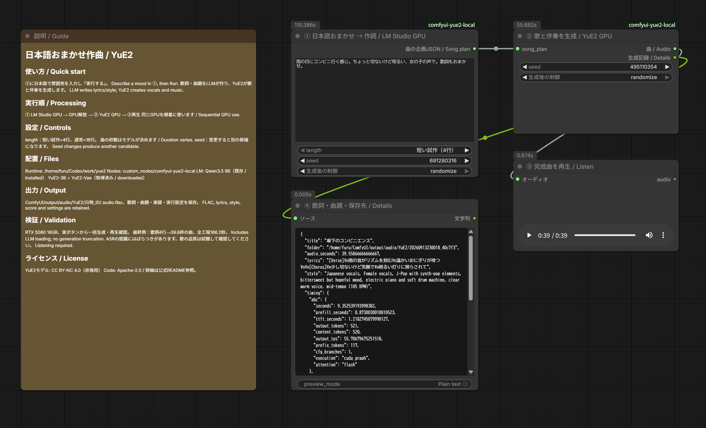

# 日本語おまかせ作曲 / Japanese Song Creation — LM Studio × YuE2 / ComfyUI

[日本語](#配布物と別途必要なもの) | [English setup guide](#english-setup-guide)

[Download / ダウンロード](https://github.com/FURUYAN1234/ComfyUI-YuE2-Japanese/releases/tag/yue2-20260914064818)


「雨の日にコンビニへ行く感じ。ちょっと切ないけど明るい、女の子の声で。歌詞もおまかせ。」と入力すると、LM StudioのLLMが日本語の歌詞と曲調を作り、YuE2が歌と伴奏を生成します。WindowsのLM Studioと、WSL内のComfyUI・専用YuE2環境を組み合わせるローカル構成です。

**対象はYuE2-3Bです。旧YuE v1向けのモデル・導入手順とは異なります。** YuE2のモデルはCC BY-NC 4.0（非商用）です。[公式リポジトリ](https://github.com/multimodal-art-projection/YuE)と各モデルの条件も確認してください。



上の画像は提供された元画像をそのまま掲載しています。39.6秒の曲を生成した時点の画面です。配布JSONには時間の目標設定とモデル選択欄を追加しています。現在の配置は [補足画像](docs/assets/workflow-current.png) を参照してください。

## 配布物と、別途必要なもの

|同梱物|用途|
|---|---|
|`workflows/*.json`|説明1枠＋実行ノードのComfyUIワークフロー|
|`custom_nodes/comfyui-yue2-local/`|カスタムノード1パッケージ。作詞・曲生成の2ノード|
|`runtime/`|LM Studio連携とYuE2子プロセスの実行コード|
|`install.py`|専用Python環境とノード、JSONの配置|
|`models.json` / `download_models.py`|13ファイルの固定取得先とSHA256確認付き取得|
|`verify_package.py` / `SHA256SUMS.json`|配布内容の欠落・変更・余分なファイル検出|
|`docs/note-article.md` / `docs/assets/`|note用原稿、提供画像、サムネイル|

**JSONだけを読み込んでも動きません。** ZIPを全部展開して導入してください。モデル、LM Studio、ComfyUI、生成曲、APIキーは同梱していません。外部の有料APIキーは不要です。初回のソフト・モデル取得にはインターネット接続を使います。

## 動作確認した環境

- Windows＋WSL2 Ubuntu、NVIDIA GeForce RTX 5080 16GB。
- ComfyUIはWSL内の既存環境。YuE2だけPython 3.12.3の独立venv。
- YuE2側：PyTorch 2.10.0+cu128 / CUDA 12.8、sm_120対応を実機確認。
- LM Studio：Qwen3.5 9B Q4_K_M、GPU最大オフロード、コンテキスト4096。
- YuE2：非量子化YuE2-3B＋YuE2-Vae、公式コードの固定コミット。通常の32ステップ生成。独自のステップ削減は行っていません。

これは16GBで短い曲を生成できた実例です。すべての長さ・他GPUの動作を保証する最低要件ではありません。YuE2のモデル本体等で約7.8GBに加え、LLM・Python環境・ダウンロード用の空き容量が必要です。余裕を持って数十GBの空き容量を用意してください。

## 1. WindowsとWSLを準備

既にWSL内でComfyUIを使えている場合は、その環境を利用できます。既存ComfyUIのPythonやTorchをこの説明のために入れ替える必要はありません。

新規の場合はWindowsに[最新のNVIDIAドライバー](https://www.nvidia.com/Download/index.aspx)を入れ、[MicrosoftのWSL導入手順](https://learn.microsoft.com/windows/wsl/install)に従います。管理者PowerShellでのUbuntu 24.04導入例です。

```powershell
wsl --install -d Ubuntu-24.04
```

案内に従って再起動とUbuntuのユーザー作成を済ませます。以降、Linux用コマンドは**Ubuntuのターミナル**で実行します。WindowsのPowerShellへLinuxのコマンドをそのまま貼り付けないでください。

```bash
sudo apt update
sudo apt install -y git python3.12-venv libsndfile1 unzip build-essential
nvidia-smi
```

GPU名が表示されることを確認します。WSL内へ別のLinux用GPUドライバーを重ねて入れる手順ではありません。GPUが見えない状態なら、先にWindows側ドライバーとWSLの状態を確認してください。

## 2. WSL内にComfyUIを準備

既存環境があれば、その実際のフォルダーを以降の `--comfyui` に指定します。新規導入は[ComfyUI公式手順](https://docs.comfy.org/installation/manual_install)を参照してください。以下はCUDA 12.8版PyTorchを使う新規作成例です。GPUとドライバーの対応はComfyUI公式手順でも確認してください。`~/ComfyUI` が既に存在する場合、この新規作成例を重ねて実行しません。

```bash
cd ~
git clone https://github.com/Comfy-Org/ComfyUI.git
cd ~/ComfyUI
python3.12 -m venv .venv
.venv/bin/python -m pip install torch==2.10.0 torchvision torchaudio --index-url https://download.pytorch.org/whl/cu128
.venv/bin/python -m pip install -r requirements.txt
.venv/bin/python main.py --listen 127.0.0.1 --port 8188
```

Windowsのブラウザーで `http://127.0.0.1:8188` を開きます。新規導入の確認ができたら、起動したターミナルで `Ctrl+C` を押して一度停止し、次の導入へ進みます。既存ComfyUIでは普段の起動方法を維持してください。YuE2用ライブラリは次の独立venvへ入るため、ComfyUI本体のrequirementsへYuE2を追加する必要はありません。

## 3. 配布ZIPを展開し、YuE2を導入

ZIPはUbuntuから使える作業フォルダーへ展開します。例：`~/Codex/packages/` 配下。ZIP名は受け取った実ファイル名を指定します。

```bash
mkdir -p ~/Codex/packages
unzip /mnt/c/Users/Windowsのユーザー名/Downloads/受け取ったZIP名.zip -d ~/Codex/packages
```

展開されたフォルダーへ移動します。`README.md` と `install.py` が見える階層が正しい位置です。ブラウザーで編集中のワークフローを保存し、ComfyUIの実行キューが空の状態にしてから導入してください。

```bash
cd ~/Codex/packages/YuE2_Japanese_LMStudio_20260914064818
python3 verify_package.py
python3 install.py --comfyui ~/ComfyUI
```

インストーラーは公式YuE2ソースを固定コミットで取得し、`~/Codex/work/yue2/.venv` にPyTorchとYuE2を入れます。既存の異なるYuE2ソースへ勝手に上書きせず停止します。その場合は `--runtime ~/Codex/work/yue2-music` のように別フォルダーを指定できます。

配布ZIPを別の場所へ展開した場合は、上記の `cd` のパスを読み替えてください。`--runtime` を変更した場合は、以降の専用環境のパスもその指定先へ読み替えます。

配置結果：

```text
~/Codex/work/yue2/
  .venv/                  YuE2専用Python
  repo/                   固定した公式YuE2ソース
  planner.py / run_song.py
~/ComfyUI/
  custom_nodes/comfyui-yue2-local/__init__.py
  custom_nodes/comfyui-yue2-local/local_config.json
  user/default/workflows/03_音声/17_音楽_YuE2/
    YuE2_日本語おまかせ_LMStudio_GPU.json
  models/yue2/
```

ノードを手動コピーする場合もフォルダーの二重入れに注意してください。`custom_nodes/comfyui-yue2-local/comfyui-yue2-local/__init__.py` ではありません。専用環境の位置はインストーラーが `local_config.json` に記録します。

導入後はComfyUIを再起動し、保存済みワークフローをブラウザーで再読込します。

## 4. LM Studioと作詞モデルを準備

Windowsに[LM Studio](https://lmstudio.ai/download)をインストールして起動します。ワークフロー左の「Qwen3.5 9Bを開く」から[モデルページ](https://lmstudio.ai/models/qwen/qwen3.5-9b)へ進み、LM Studioで **Qwen3.5 9BのQ4_K_M** をダウンロードしてください。作詞側モデルはComfyUIのmodelsフォルダーへ入れません。

UbuntuからWindows側CLIが見えることを確認します。

```bash
(cd ~/Codex/work/yue2 && python3 -c "import planner; print(planner.cli('ls'))")
```

通常インストールのLM Studio CLIはWindowsのLocalAppDataから自動検出します。独自配置で見つからない場合のみ、ComfyUIを起動するUbuntuシェルで `YUE2_LMS_CLI` に実在する `lms.exe` のWSL形式パスを設定します。

```bash
export YUE2_LMS_CLI='/mnt/c/実際の配置先/lms.exe'
```

実行時にCLIで専用の `yue2-planner` としてモデルをロードし、作詞後にそのモデルだけをアンロードします。LM Studioは起動しておいてください。他の大きなモデルを手動ロードしたままだとVRAMが足りなくなることがあります。

接続先はWSLの既定ゲートウェイ側Windows、ポート1234です。APIが停止していればCLIで同アドレスへ起動します。WSLからWindowsへの接続が許可された構成を前提とし、インターネットへポートを公開する必要はありません。ミラーネットワーク、ポート変更、API認証必須構成はこの版の実機検証対象外です。接続できない場合はLM StudioのDeveloper画面とWindowsのファイアウォールを確認してください。

## 5. ワークフローからモデルを取得

左側のワークフロー一覧で `03_音声 → 17_音楽_YuE2` を開きます。②のモデル選択欄と `properties.models` に、公式の固定リビジョンの取得先を設定しています。不足モデルの案内から取得先を開ける、ComfyUIで一般的な形式です。

**重み2ファイルだけでは動きません。** 設定・トークナイザー・ライセンスを含む13ファイルが必要です。ComfyUIの版によってはブラウザーのDownloadsへ保存され、自動でWSLの正しいフォルダーへ配置されません。**②の「必須モデル一式を取得 / Download models」ボタン**なら、全13ファイルを所定位置へ保存し、サイズとSHA256も確認します。取得中は同じボタンに状態を表示します。失敗時にはエラーが表示され、未完了の `.part` は完成品として使われません。ボタンと同じ処理をUbuntuから実行する方法は次です。

```bash
cd ~/Codex/packages/YuE2_Japanese_LMStudio_20260914064818
python3 download_models.py --comfyui ~/ComfyUI
python3 download_models.py --comfyui ~/ComfyUI --check-only
```

必須配置：

```text
ComfyUI/models/yue2/
  YuE2-3B/
    model.safetensors
    config.json
    generation_config.json
    yue2_generation_config.json
    qwen.tiktoken
    weights_manifest.json
    LICENSE
    THIRD_PARTY_NOTICES.md
  YuE2-Vae/
    model.safetensors
    config.json
    weights_manifest.json
    LICENSE
    THIRD_PARTY_NOTICES.md
```

既存ファイルが正しければ再取得しません。内容不一致は上書きせずエラーになります。取得途中の `.part` は完成品として使いません。モデルの追加後はComfyUIを再起動またはモデル一覧を更新し、②で上記の2つの `model.safetensors` を選択してください。

## 6. 日本語で入力して生成

①に、例えば次を入力して「実行する」を押します。

> 雨の日にコンビニ行く感じ。ちょっと切ないけど明るい、女の子の声で。歌詞もおまかせ。

処理は「①作詞と曲調 → 作詞LLM解放 → ②YuE2生成 → ③再生」の順です。英語の曲調を書く必要はありません。④には歌詞・英語の曲調・実際の曲の秒数・保存先が表示されます。

|設定|意味|
|---|---|
|`brief`|日本語の希望。ジャンル、雰囲気、声、場面など|
|`length`|従来モードで使う歌詞量。短い試作4行／通常16行|
|`duration_mode`|従来の歌詞量、目標30／60／120秒（試験的）、数値指定|
|`target_seconds`|「秒数を指定（目安）」の時に使う10～240の整数|
|①`seed`|作詞候補を変える種|
|②`seed`|同じ歌詞・曲調から曲の候補を変える種|
|`model` / `vae`|取得済みYuE2-3B / YuE2-Vaeの重み|

時間は本文に「30秒くらい」と日本語で書くこともできます。ただし本文だけの秒数はLLMへの希望で、数値として検証する専用パーサーはありません。明確に渡したい場合はノードの時間設定を使います。ノードの秒数モードは本文より優先し、歌詞量と曲調への指示を調整します。

**時間設定は試験的で、精度は低いです。30秒指定でも62.1秒になった実測があります。** YuE2の通常リクエストには正確な出力秒数を固定する引数がありません。長い無音や歌の途中を切って指定秒数に合わせる処理も入れていません。完成尺が必須の用途では、完成曲を試聴してから別途編集してください。60／120秒・数値上限の実生成は未検証です。

## 出力先と記録

`ComfyUI/output/audio/YuE2/日時_ID/` へ保存します。主なファイルは `audio.flac`、`song_plan.json`、`score.abc`、`result.json` です。元の指示、生成歌詞・曲調、seedなどを残すため、別候補との比較に使えます。再生ノードの一時音声とは別に、完成音声をoutputへ保存します。

実行ログは専用環境の `jobs/` にあります。ログには入力した文章が含まれるため、公開配布へそのまま混ぜないでください。

## 実測と確認範囲

|条件|生成音声の長さ|全工程時間|
|---|---:|---:|
|日本語おまかせ、従来4行|39.5587秒|166.211秒|
|日本語おまかせ、目標30秒|62.1187秒|191.927秒|

全工程時間はComfyUIの実行開始から成功まで。LLMのロード、作詞、解放、YuE2のロードと生成、保存を含みます。成功した各1回の値で、前の失敗試行やモデルダウンロード時間は含みません。実行キャッシュによるノード省略はありません。従来4行のYuE2子プロセスのピークGPU確保量は約7.84GiB、予約量は約7.88GiBです。PC全体の最大VRAM値ではありません。

実際のComfyUIボタンから曲生成・ファイル保存を確認し、39.6秒音声はブラウザーの再生位置が進むことも確認しました。ASRでは日本語の冒頭が認識される一方、サビに歌詞との不一致がありました。歌唱側の違いと認識器の誤りをASRだけでは分けられないため、全歌詞の正確な歌唱や音楽品質の合格とは扱っていません。

日本語の曖昧な指示はLLMが具体的な歌詞と英語の曲調へ変換できました。またYuE2単体へ日本語の曲調と日本語歌詞を渡す実験でも生成は成功しています。「日本語は全く使えない」という結果ではありません。ただし、曖昧な要望をそのまま毎回意図通りに歌へ変換する能力の保証でもありません。[公式デモ](https://map-yue2.github.io/)にも日本語歌唱例があります。

## 困ったとき

|症状|確認する場所・対処|
|---|---|
|赤い未定義ノード|カスタムノードの配置階層とComfyUI起動ログを確認。配置後に本体再起動とブラウザー再読込|
|モデルがない／config・tokenizerがない|重みだけでなく13ファイルを取得し `download_models.py --check-only` で検査|
|CUDAが使えない／sm_120エラー|WSLの `nvidia-smi` とYuE2専用venvのTorchを確認。ComfyUI側と混同しない|
|LM Studio CLIがない|Windowsへ通常インストールして起動。独自配置なら `YUE2_LMS_CLI` を実パスで指定|
|モデルが見つからない|LM StudioでQwen3.5 9B Q4_K_Mの取得を完了。識別名 `qwen/qwen3.5-9b` を確認|
|接続拒否／タイムアウト|LM Studio Developer画面、ポート1234、WSLからWindowsへの通信を確認|
|VRAM不足|他の画像・動画・LLM処理を終え、短い試作で再実行|
|作詞が途中終了|曲生成は開始しません。ログとLM Studioのモデル設定を確認して再実行|
|中止がすぐ反映されない|YuE2子プロセスは停止処理あり。LM Studioのロード／API応答中は最大約180秒の待ちが残り得ます|
|秒数や歌詞が期待と違う|④と音声を確認。時間は目標、歌唱品質は候補ごとに試聴。seedで別候補を作成|

## バージョン管理と再構築

[GitHubソース](https://github.com/FURUYAN1234/ComfyUI-YuE2-Japanese) / [この版のRelease](https://github.com/FURUYAN1234/ComfyUI-YuE2-Japanese/releases/tag/yue2-20260914064818)

配布版：`20260914064818`、タグ：`yue2-20260914064818`。Releaseの `YuE2_Japanese_LMStudio_20260914064818.zip` を使用してください。GitHub自動生成のSource code ZIPとは別です。


配布識別子は `VERSION`、変更点は `CHANGELOG.md` に記載しています。ソースはGitで管理し、改行変換を止める `.gitattributes` を設定しています。GitHubのタグ付きReleaseから配布ZIPを取得できます。

タグ付きソースからの構築：

```bash
git clone --branch yue2-20260914064818 https://github.com/FURUYAN1234/ComfyUI-YuE2-Japanese.git
cd ComfyUI-YuE2-Japanese
```

```bash
python3 build_package.py --output /保存先フォルダー
```

生成ZIPを新規フォルダーへ展開し、その中で `python3 verify_package.py` を実行します。SHA256一覧はマニフェスト自身以外の全ファイルを対象とし、余分なファイルもエラーにします。確認後にPythonを実行すると `__pycache__` ができる場合があるため、配布原本の確認は導入前に行ってください。

## ライセンス・参照

連携コード：Apache-2.0。YuE2モデル：CC BY-NC 4.0。Qwen・LM Studio・ComfyUIは各配布元の条件に従います。詳細は `LICENSE` と `NOTICE.md`、取得した各モデル内のライセンスを参照してください。

- [YuE2公式ソース](https://github.com/multimodal-art-projection/YuE)
- [YuE2-3B](https://huggingface.co/m-a-p/YuE2-3B) / [YuE2-Vae](https://huggingface.co/m-a-p/YuE2-Vae)
- [LM StudioのQwen3.5 9Bページ](https://lmstudio.ai/models/qwen/qwen3.5-9b)
- [導入検討時の参考記事](https://note.com/humble_bobcat51/n/n977c99a109eb)


## 歌詞・曲情報と完了表示

④は「✅ 曲の生成が完了 / Completed」を先頭に、曲名、実際の長さ、目標時間、時間設定、曲生成・保存の所要時間、改行付き歌詞、曲調・声・楽器、保存先を表示します。表示を読みやすくする変更で、後続ノードへ渡す生成記録JSONは維持します。曲生成時間にはLM Studioでの作詞時間を含みません。

既存利用者は最新版ZIPを展開して整合性を確認し、`python3 install.py --comfyui ~/ComfyUI` を実行後、ComfyUIを再起動してブラウザーを再読込してください。編集中の指示は先に保存し、インストーラーが作るバックアップも保持してください。


更新後の通常ワークフローも実機で再確認：従来4行の日本語入力から59.9587秒の曲を生成。全工程171.848秒（作詞・ロード・保存を含む、キャッシュ省略なし）。曲生成から保存まで68.72秒。実ブラウザーで改行付き歌詞・曲情報・完了表示を確認。既存の同一条件をキャッシュで再表示する経路も確認。

公開記事・試聴例：https://note.com/happy_duck780/n/n57df44cf7fd2


掲載サンプル「傘下のコンビニエンス」（39.6秒）の生成歌詞：

```text
[Verse]
雨の音がリズムを刻む
温かいおにぎりが待つ

[Chorus]
少し切ないけど笑顔で
明るい灯りに照らされて
```

歌唱の書き起こしではなく、生成時に指定した歌詞です。試聴音声はnoteに掲載し、配布ZIPには同梱しません。

## English setup guide

Describe the song you want in Japanese. LM Studio creates Japanese lyrics and an English style prompt; YuE2 generates vocals and accompaniment. The LLM is unloaded before music generation so they use the GPU sequentially. This integration targets **YuE2-3B, not legacy YuE v1**.

### Download and prerequisites

Download the named `YuE2_Japanese_LMStudio_20260914064818.zip` asset from the Release linked above, and extract the entire ZIP. The workflow JSON alone is insufficient. The ZIP contains the workflow, custom nodes, installer, isolated runtime scripts, model manifest/downloader, integrity checker, documentation and licenses. It does not include weights, LM Studio, ComfyUI, generated songs or credentials. No paid external API key is required; initial software/model downloads need internet access.

Use Windows with NVIDIA drivers, WSL2 Ubuntu, ComfyUI inside WSL and LM Studio on Windows. Keep tens of GB of disk space free for models, environments and downloads. The tested GPU is listed in the Japanese validation section: it is a measurement condition, not a universal minimum specification. Other GPUs and all song lengths have not been tested.

### 1. Prepare WSL and ComfyUI

If WSL ComfyUI already works, keep it and use its real folder in `--comfyui`; do not replace its Python/Torch just to match this guide. For a fresh setup, install the Windows NVIDIA driver and follow Microsoft's WSL instructions linked above. In administrator PowerShell:

```powershell
wsl --install -d Ubuntu-24.04
```

Restart/create the Linux user as prompted. Run subsequent Linux commands in the **Ubuntu terminal**, not PowerShell:

```bash
sudo apt update
sudo apt install -y git python3.12-venv libsndfile1 unzip build-essential
nvidia-smi
```

Confirm the GPU is visible. Do not install another Linux GPU display driver inside WSL. For a new ComfyUI installation only, follow the official ComfyUI guide linked above; the Japanese section includes a complete CUDA 12.8/PyTorch 2.10.0 command example. Check that your GPU/driver is supported. Open `http://127.0.0.1:8188` from Windows. After verifying a fresh installation, stop that terminal with Ctrl+C before installing these nodes.

### 2. Install the complete package

Save unsaved workflows and let the ComfyUI queue finish. Replace the Windows username and downloaded ZIP filename in this example:

```bash
mkdir -p ~/Codex/packages
unzip /mnt/c/Users/YOUR_WINDOWS_USER/Downloads/YuE2_Japanese_LMStudio_20260914064818.zip -d ~/Codex/packages
cd ~/Codex/packages/YuE2_Japanese_LMStudio_20260914064818
python3 verify_package.py
python3 install.py --comfyui ~/ComfyUI
```

The installer checks out a pinned official YuE2 commit and installs its dependencies into `~/Codex/work/yue2/.venv`, separate from ComfyUI. It installs nodes into `custom_nodes/comfyui-yue2-local`, and the workflow into `user/default/workflows/03_音声/17_音楽_YuE2`. Runtime paths are recorded in the generated `local_config.json`. Avoid an extra nested custom-node folder.

If an incompatible existing YuE2 source is detected, use a separate `--runtime ~/Codex/work/yue2-music` directory; adapt later paths accordingly. Restart ComfyUI and reload the browser after installation. Preserve existing workflow backups when upgrading.

### 3. Prepare LM Studio

Install and launch LM Studio on Windows. Download **Qwen3.5 9B Q4_K_M** through the LM Studio model page linked above. The workflow guide also links to it. This LLM belongs in LM Studio, not ComfyUI's models folder.

```bash
(cd ~/Codex/work/yue2 && python3 -c "import planner; print(planner.cli('ls'))")
```

The Windows CLI is discovered from LocalAppData. Only for a nonstandard installation, set `YUE2_LMS_CLI` to the actual WSL path of `lms.exe` in the shell that launches ComfyUI. Keep LM Studio open. The runtime loads a dedicated `yue2-planner` model with maximum GPU offload/context 4096, then unloads that model after planning. Other manually loaded large models can cause VRAM exhaustion.

The current runtime connects to the Windows host via WSL's default gateway on port 1234 and starts the API through the CLI if necessary. Internet-facing port exposure is unnecessary. Mirrored networking, custom ports and authentication-required API configurations have not been validated. Inspect LM Studio's Developer screen and Windows firewall if connection fails.

### 4. Download music models from the workflow

Open `03_音声 → 17_音楽_YuE2` in the ComfyUI workflow browser. On node ②, click **必須モデル一式を取得 / Download models**. It fetches all 13 pinned files, verifies size and SHA256, and saves them under `ComfyUI/models/yue2/YuE2-3B/` and `YuE2-Vae/`. This includes configuration, tokenizer and licenses, not just the two weight files. Progress/errors appear on the button. Incomplete `.part` files are never treated as completed weights.

The standard missing-model dialog also has download URLs, but depending on ComfyUI/browser version these may save to Downloads without placing files inside WSL. Prefer the integrated button or this equivalent command:

```bash
cd ~/Codex/packages/YuE2_Japanese_LMStudio_20260914064818
python3 download_models.py --comfyui ~/ComfyUI
python3 download_models.py --comfyui ~/ComfyUI --check-only
```

Valid existing files are reused. Mismatched files produce an error rather than being overwritten. Refresh model lists/restart ComfyUI and select the two model.safetensors entries in node ②.

### 5. Generate, read lyrics and listen

Enter a casual Japanese brief in node ① and run the workflow. Example: `雨の日にコンビニ行く感じ。ちょっと切ないけど明るい、女の子の声で。歌詞もおまかせ。` This requests a bittersweet but cheerful song about going to a convenience store in the rain, with a female voice and automatic lyrics.

The sequence is planning → LLM unload → YuE2 generation → audio preview. Node ④ shows **✅ 曲の生成が完了 / Completed**, title, actual duration, target, duration mode, generation/save time, multiline lyrics, style/voice/instruments and saved folder. The generation/save time excludes LM Studio planning. The original JSON output remains usable downstream.

| Control | Meaning |
|---|---|
| brief | Japanese mood, scene, genre or voice request |
| length | Legacy lyric amount: short 4 lines or normal 16 lines |
| duration_mode | Legacy length, approximate 30/60/120 seconds, or numeric target |
| target_seconds | Integer 10–240, used only in the numeric-target mode |
| planner seed | Change the lyric/style candidate |
| song seed | Change the music candidate for the same plan |
| model / vae | Downloaded YuE2-3B and YuE2-Vae weights |

A duration request in Japanese prose is an LLM instruction, not a separately parsed numeric constraint. Node duration controls take precedence. **Duration is approximate and currently inaccurate**: one 30-second target produced 62.1 seconds. The integration adjusts lyric amount/style; it does not trim a song to force an exact length. 60/120-second runs and the numeric maximum are untested. Listen and edit afterward when exact duration matters.

### Output and troubleshooting

Songs are saved to `ComfyUI/output/audio/YuE2/DATETIME_ID/`: `audio.flac`, `song_plan.json`, `score.abc` and `result.json`. Runtime `jobs/` logs contain prompts; do not publish personal logs. The note article linked below includes an actual 39.6-second listening sample and its supplied lyrics; sung words may differ.

| Problem | Action |
|---|---|
| Missing red nodes | Check custom-node folder depth and startup logs; restart server and reload browser |
| Missing config/tokenizer/weights | Download all 13 files and run `--check-only` |
| CUDA/sm_120 error | Check WSL nvidia-smi and Torch in the YuE2 venv, not the ComfyUI venv |
| CLI/model not found | Launch LM Studio, finish Qwen3.5 9B Q4_K_M download; set actual CLI path if nonstandard |
| Connection refused | Check LM Studio Developer screen, port 1234 and host firewall |
| Out of memory | Finish other image/video/LLM workloads and retry a short song |
| Truncated planning | Music generation will not start; inspect logs/model settings and retry |
| Slow cancellation | YuE2 subprocess can be stopped; LM Studio loading/API waits may take up to about 180 seconds |
| Unexpected lyrics/duration | Inspect node ④ and listen; try another seed; duration is only a target |

### Validation, rebuilding and licenses

Existing live tests include 39.5587 seconds of audio in 166.211 seconds end to end, a 30-second target yielding 62.1187 seconds in 191.927 seconds, and the readable-lyrics update yielding 59.9587 seconds in 171.848 seconds. End-to-end values include model loading, planning, unloading, music generation and saving, but exclude downloads and earlier failed attempts; no cached node skipping. These are individual measurements, not speed guarantees. Audio playback progression and readable completion/metadata were observed in the actual browser. ASR mismatches remain; this is not a subjective music-quality pass or a fresh-other-PC installation test.

For a reproducible build, clone the exact `yue2-20260914064818` tag linked above, run `python3 build_package.py --output /YOUR_OUTPUT_FOLDER`, extract into a new folder and run `python3 -B verify_package.py` there. The manifest covers every packaged file except itself and rejects extra files. Normal Python execution can create __pycache__, so verify the clean package before installation. Compare relative paths and SHA256 values with the Release ZIP.

Integration code: Apache-2.0. YuE2 models: **CC BY-NC 4.0 (noncommercial)**. LM Studio, Qwen and ComfyUI have their own terms. See LICENSE, NOTICE.md and the downloaded model licenses. Software and models remain separate downloads.
