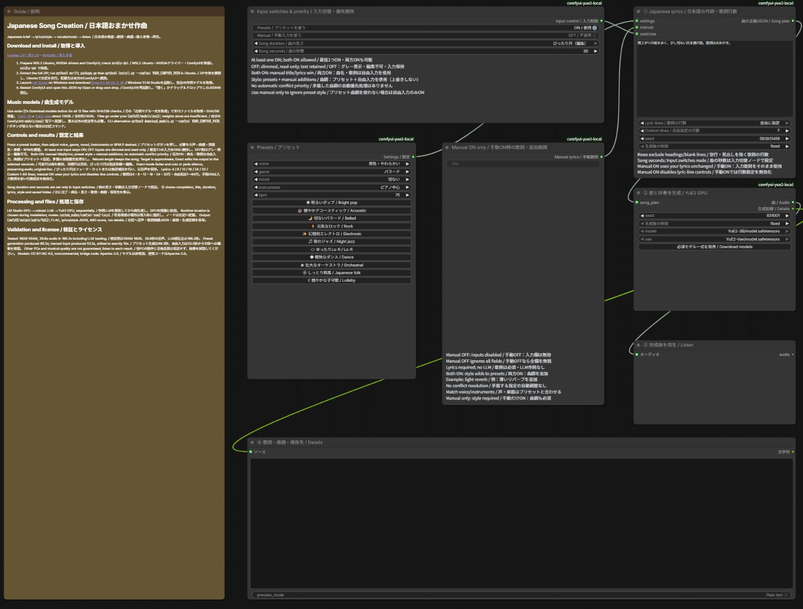
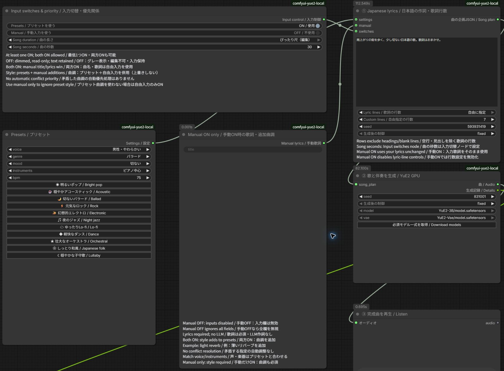
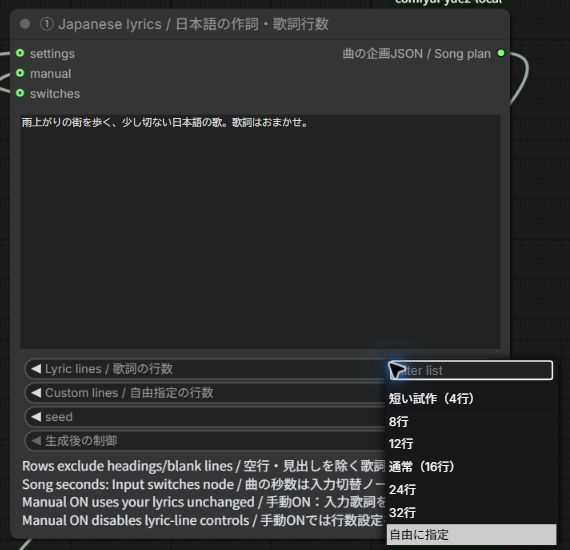

# 日本語でおまかせ作曲。LM Studio × YuE2のComfyUI導入ガイド


画像のワークフローと同じように、「こんな感じの曲がほしい」と日本語で書いて、あとはローカルのAIに任せたい。今回は、その入口をComfyUIに用意しました。

入力するのは、たとえばこんな一言です。

> 雨の日にコンビニ行く感じ。ちょっと切ないけど明るい、女の子の声で。歌詞もおまかせ。

LM StudioのQwen3.5 9Bがこの文章から歌詞と曲調を作り、YuE2が歌と伴奏を生成します。作詞モデルをGPUから解放してから曲生成へ進むので、同じGPUを順番に使います。

試した環境では、4行の日本語歌詞から39.6秒の曲ができました。ComfyUIの実行開始から保存完了までは166.2秒。モデルの読み込みも含む時間です。ただし日本語の発音や歌詞の再現には確認が必要で、今回の結果を「毎回そのまま完成曲として使える」とは扱っていません。

## ワークフローの入手

- [導入ZIP v1.2.1](https://github.com/FURUYAN1234/ComfyUI-YuE2-Japanese/releases/download/v1.2.1/YuE2_Japanese_LMStudio_v1.2.1.zip)
- [ワークフローJSON](https://github.com/FURUYAN1234/ComfyUI-YuE2-Japanese/releases/download/v1.2.1/YuE2_Japanese_LMStudio.json)

初回はZIP全体を導入してください。JSON単体は導入済み環境への読み込み用です。



## ボタンで選ぶ・日本語で任せる・自由入力する



プリセットノードには「明るいポップ」「穏やかアコースティック」「切ないバラード」「元気なロック」「幻想的エレクトロ」に加え、「夜のジャズ」「ゆったりLo-fi」「軽快なダンス」「壮大なオーケストラ」「しっとり和風」「穏やかな子守歌」の計11種類のボタンがあります。押すと声・曲調・雰囲気・楽器・BPMがまとめて入り、個別の選択欄で調整できます。音声の特徴を指示するもので、特定の歌手の声を再現する音声クローン機能ではありません。

独立した入力切替ノードに「プリセットを使う」「手動入力を使う」のON/OFFスイッチがあります。プリセットだけONなら、日本語の希望と選択設定からLM Studioが作詞します。手動だけONなら、入力した曲名・歌詞・曲調だけを使います（歌詞と曲調は必須）。両方ONなら、手動歌詞を使い、プリセットに手動曲調を追加します。最後に残ったONをOFFにしようとしてもONを維持します。片方を切り替えるときは、先にもう片方をONにしてください。

OFF側のプリセット・自由入力欄はグレー表示になり編集できません。入力済みの内容は消さず、ONにすると再び使えます。曲調の矛盾は自動調整しないため、声や楽器を変更するときはプリセット側も合わせるか、その項目をおまかせにしてください。



歌詞の行数は作詞ノードで「4・8・12・16・24・32行」「自由に指定（1〜64行）」から選べます。空行・見出しは行数に含めません。手動ONでは入力した歌詞をそのまま採用し、行数設定を無効表示にします。

曲の長さは「入力切替・優先関係」ノードの「曲の長さ」「曲の秒数」で設定します。作詞ノードの重複した時間設定はなくしました。歌詞行数と秒数は別の設定で、目標秒数によって選択行数を勝手に変えません。「可変尺」は自然に生成された長さを保ち、「目標尺」は指定秒数を目安に作詞します。「ぴったり尺」は生成後の音声をフェード・カット、または無音補完で指定秒数へ編集します。元の曲は audio_original.flac に残します。歌詞やフレーズの途中で切れる場合があり、モデルが自然な終わり方で秒数を守るという意味ではありません。

実検証では、プリセットから68.3秒の曲を生成しました。自由入力では53.5秒の元音声を生成し、10秒へ編集できました。完成欄には曲名・長さ・作成方法・歌詞・曲調を表示します。

v1.2.0の実生成検証では、自由指定7行から実際に7行の歌詞を生成し、約73.0秒の元音声を30.0秒へ編集できました。全工程194.824秒（モデル読込込み、キャッシュ省略なし）。手動入力は行数設定にかかわらず入力歌詞を保持することも確認しています。1〜64行の入力検査を行い、実曲生成は7行で確認しました。

配布例は「自由指定7行・ぴったり尺30秒」で開きます。生成された曲を全て残したい場合は、曲の長さを「可変尺」に変更してください。

## 最初に知っておいてほしいこと

扱うのは、リンク先の現在のYuE2-3Bです。旧YuE v1の導入記事とモデルを混ぜないでください。また、YuE2モデルはCC BY-NC 4.0、非商用の条件です。

YuE2単体でも日本語の歌詞・曲調で生成する実験は通りました。今回LLMを間に入れたのは、日本語が一切使えないからではなく、短く曖昧な依頼から歌詞や楽器・声・曲調まで補ってもらうためです。

以下は、これまでの[日本語LLMを使う動画ワークフロー記事](https://note.com/happy_duck780/n/n15e732b3147b)と同じく、配布物の中身、環境構築、モデル取得、操作、保存先の順で説明します。JSONだけでなく、導入スクリプトとカスタムノードを含むZIP一式を使ってください。

## 配布物と、別途必要なもの

|同梱物|用途|
|---|---|
|`workflows/*.json`|説明1枠＋実行ノードのComfyUIワークフロー|
|`custom_nodes/comfyui-yue2-local/`|カスタムノード1パッケージ。入力切替・プリセット・自由入力・作詞・曲生成のノード|
|`runtime/`|LM Studio連携とYuE2子プロセスの実行コード|
|`install.py`|専用Python環境とノード、JSONの配置|
|`models.json` / `download_models.py`|13ファイルの固定取得先とSHA256確認付き取得|
|`verify_package.py` / `SHA256SUMS.json`|配布内容の欠落・変更・余分なファイル検出|
|`docs/note-article.md` / `assets/`|note用原稿、ワークフロー画像、サムネイル|

**JSONだけを読み込んでも動きません。** ZIPを全部展開して導入してください。モデル、LM Studio、ComfyUI、生成曲、APIキーは同梱していません。外部の有料APIキーは不要です。初回のソフト・モデル取得にはインターネット接続を使います。

## 動作確認した環境

- Windows＋WSL2 Ubuntu、NVIDIA GeForce RTX 5080 16GB。
- ComfyUIはWSL内の既存環境。YuE2だけPython 3.12.3の独立venv。
- YuE2側：PyTorch 2.10.0+cu128 / CUDA 12.8、sm_120対応を実機確認。
- LM Studio：Qwen3.5 9B Q4_K_M、GPU最大オフロード、コンテキスト4096。
- YuE2：非量子化YuE2-3B＋YuE2-Vae、公式コードの固定コミット。通常の32ステップ生成。独自のステップ削減は行っていません。

これは16GBで短い曲を生成できた実例です。すべての長さ・他GPUの動作を保証する最低要件ではありません。YuE2のモデル本体等で約7.8GBに加え、LLM・Python環境・ダウンロード用の空き容量が必要です。余裕を持って数十GBの空き容量を用意してください。

## 1. WindowsとWSLを準備

既にWSL内でComfyUIを使えている場合は、その環境を利用できます。既存ComfyUIのPythonやTorchをこの説明のために入れ替える必要はありません。

新規の場合はWindowsに[最新のNVIDIAドライバー](https://www.nvidia.com/Download/index.aspx)を入れ、[MicrosoftのWSL導入手順](https://learn.microsoft.com/windows/wsl/install)に従います。管理者PowerShellでのUbuntu 24.04導入例です。

```powershell
wsl --install -d Ubuntu-24.04
```

案内に従って再起動とUbuntuのユーザー作成を済ませます。以降、Linux用コマンドは**Ubuntuのターミナル**で実行します。WindowsのPowerShellへLinuxのコマンドをそのまま貼り付けないでください。

```bash
sudo apt update
sudo apt install -y git python3.12-venv libsndfile1 unzip build-essential
nvidia-smi
```

GPU名が表示されることを確認します。WSL内へ別のLinux用GPUドライバーを重ねて入れる手順ではありません。GPUが見えない状態なら、先にWindows側ドライバーとWSLの状態を確認してください。

## 2. WSL内にComfyUIを準備

既存環境があれば、その実際のフォルダーを以降の `--comfyui` に指定します。新規導入は[ComfyUI公式手順](https://docs.comfy.org/installation/manual_install)を参照してください。以下はCUDA 12.8版PyTorchを使う新規作成例です。GPUとドライバーの対応はComfyUI公式手順でも確認してください。`~/ComfyUI` が既に存在する場合、この新規作成例を重ねて実行しません。

```bash
cd ~
git clone https://github.com/Comfy-Org/ComfyUI.git
cd ~/ComfyUI
python3.12 -m venv .venv
.venv/bin/python -m pip install torch==2.10.0 torchvision torchaudio --index-url https://download.pytorch.org/whl/cu128
.venv/bin/python -m pip install -r requirements.txt
.venv/bin/python main.py --listen 127.0.0.1 --port 8188
```

Windowsのブラウザーで `http://127.0.0.1:8188` を開きます。新規導入の確認ができたら、起動したターミナルで `Ctrl+C` を押して一度停止し、次の導入へ進みます。既存ComfyUIでは普段の起動方法を維持してください。YuE2用ライブラリは次の独立venvへ入るため、ComfyUI本体のrequirementsへYuE2を追加する必要はありません。

## 3. 配布ZIPを展開し、YuE2を導入

ZIPはUbuntuから使える作業フォルダーへ展開します。例：`~/Downloads/yue2-packages/` 配下。ZIP名は受け取った実ファイル名を指定します。

```bash
mkdir -p ~/Downloads/yue2-packages
unzip /mnt/c/Users/Windowsのユーザー名/Downloads/受け取ったZIP名.zip -d ~/Downloads/yue2-packages
```

展開されたフォルダーへ移動します。`README.md` と `install.py` が見える階層が正しい位置です。ブラウザーで編集中のワークフローを保存し、ComfyUIの実行キューが空の状態にしてから導入してください。

```bash
cd ~/Downloads/yue2-packages/YuE2_Japanese_LMStudio_v1.2.1
python3 verify_package.py
python3 install.py --comfyui ~/ComfyUI
```

インストーラーは公式YuE2ソースを固定コミットで取得します。新規環境は `~/.local/share/yue2/.venv` に作成し、更新時は既存の `local_config.json` にある専用環境を維持します。既存の異なるYuE2ソースへ勝手に上書きせず停止します。その場合は `--runtime ~/.local/share/yue2-music` のように別フォルダーを指定できます。

配布ZIPを別の場所へ展開した場合は、上記の `cd` のパスを読み替えてください。`--runtime` を変更した場合は、以降の専用環境のパスもその指定先へ読み替えます。

配置結果：

```text
~/.local/share/yue2/
  .venv/                  YuE2専用Python
  repo/                   固定した公式YuE2ソース
  planner.py / run_song.py
~/ComfyUI/
  custom_nodes/comfyui-yue2-local/__init__.py
  custom_nodes/comfyui-yue2-local/local_config.json
  user/default/workflows/YuE2/
    YuE2_日本語おまかせ_LMStudio_GPU.json
  models/yue2/
```

ノードを手動コピーする場合もフォルダーの二重入れに注意してください。`custom_nodes/comfyui-yue2-local/comfyui-yue2-local/__init__.py` ではありません。専用環境の位置はインストーラーが `local_config.json` に記録します。

導入後はComfyUIを再起動し、保存済みワークフローをブラウザーで再読込します。

## 4. LM Studioと作詞モデルを準備

Windowsに[LM Studio](https://lmstudio.ai/download)をインストールして起動します。ワークフロー左の「Qwen3.5 9Bを開く」から[モデルページ](https://lmstudio.ai/models/qwen/qwen3.5-9b)へ進み、LM Studioで **Qwen3.5 9BのQ4_K_M** をダウンロードしてください。作詞側モデルはComfyUIのmodelsフォルダーへ入れません。

UbuntuからWindows側CLIが見えることを確認します。

```bash
(cd ~/.local/share/yue2 && python3 -c "import planner; print(planner.cli('ls'))")
```

通常インストールのLM Studio CLIはWindowsのLocalAppDataから自動検出します。独自配置で見つからない場合のみ、ComfyUIを起動するUbuntuシェルで `YUE2_LMS_CLI` に実在する `lms.exe` のWSL形式パスを設定します。

```bash
export YUE2_LMS_CLI='/mnt/c/実際の配置先/lms.exe'
```

実行時にCLIで専用の `yue2-planner` としてモデルをロードし、作詞後にそのモデルだけをアンロードします。LM Studioは起動しておいてください。他の大きなモデルを手動ロードしたままだとVRAMが足りなくなることがあります。

接続先はWSLの既定ゲートウェイ側Windows、ポート1234です。APIが停止していればCLIで同アドレスへ起動します。WSLからWindowsへの接続が許可された構成を前提とし、インターネットへポートを公開する必要はありません。ミラーネットワーク、ポート変更、API認証必須構成はこの版の実機検証対象外です。接続できない場合はLM StudioのDeveloper画面とWindowsのファイアウォールを確認してください。

## 5. ワークフローからモデルを取得

取得したワークフローJSONをComfyUIの「開く」、またはキャンバスへのドラッグ＆ドロップで読み込みます。②のモデル選択欄と `properties.models` に、公式の固定リビジョンの取得先を設定しています。不足モデルの案内から取得先を開ける、ComfyUIで一般的な形式です。

**重み2ファイルだけでは動きません。** 設定・トークナイザー・ライセンスを含む13ファイルが必要です。ComfyUIの版によってはブラウザーのDownloadsへ保存され、自動でWSLの正しいフォルダーへ配置されません。**②の「必須モデル一式を取得 / Download models」ボタン**なら、全13ファイルを所定位置へ保存し、サイズとSHA256も確認します。取得中は同じボタンに状態を表示します。失敗時にはエラーが表示され、未完了の `.part` は完成品として使われません。ボタンと同じ処理をUbuntuから実行する方法は次です。

```bash
cd ~/Downloads/yue2-packages/YuE2_Japanese_LMStudio_v1.2.1
python3 download_models.py --comfyui ~/ComfyUI
python3 download_models.py --comfyui ~/ComfyUI --check-only
```

必須配置：

```text
ComfyUI/models/yue2/
  YuE2-3B/
    model.safetensors
    config.json
    generation_config.json
    yue2_generation_config.json
    qwen.tiktoken
    weights_manifest.json
    LICENSE
    THIRD_PARTY_NOTICES.md
  YuE2-Vae/
    model.safetensors
    config.json
    weights_manifest.json
    LICENSE
    THIRD_PARTY_NOTICES.md
```

既存ファイルが正しければ再取得しません。内容不一致は上書きせずエラーになります。取得途中の `.part` は完成品として使いません。モデルの追加後はComfyUIを再起動またはモデル一覧を更新し、②で上記の2つの `model.safetensors` を選択してください。

## 6. 日本語で入力して生成

①に、例えば次を入力して「実行する」を押します。

> 雨の日にコンビニ行く感じ。ちょっと切ないけど明るい、女の子の声で。歌詞もおまかせ。

処理は「①作詞と曲調 → 作詞LLM解放 → ②YuE2生成 → ③再生」の順です。英語の曲調を書く必要はありません。④には歌詞・英語の曲調・実際の曲の秒数・保存先が表示されます。

|設定|意味|
|---|---|
|`brief`|日本語の希望。ジャンル、雰囲気、声、場面など|
|歌詞の行数|4・8・12・16・24・32行／自由に指定|
|自由指定の行数|1〜64行。自由指定のときだけ編集可能。空行と見出しは数えません|
|設定ノード `use_presets` / `use_manual`|個別ON/OFF。片方だけ・両方ONに対応。両方OFFは不可|
|設定ノード `timing`|可変尺・目標尺・ぴったり尺（編集）|
|設定ノード `seconds`|目標尺・ぴったり尺で使う10～240の整数|
|声・曲調・楽器・BPM|ボタンで一括設定した後、個別に調整可能|
|①`seed`|作詞候補を変える種|
|②`seed`|同じ歌詞・曲調から曲の候補を変える種|
|`model` / `vae`|取得済みYuE2-3B / YuE2-Vaeの重み|

時間は本文に「30秒くらい」と日本語で書くこともできます。ただし本文だけの秒数はLLMへの希望で、数値として検証する専用パーサーはありません。明確に渡したい場合はノードの時間設定を使います。ノードの秒数モードは本文より優先し、指定した歌詞行数を保ち、短い表現・テンポ・曲調への指示を調整します。

**目標尺は目安です。** 旧版の30秒指定では62.1秒となった実測があります。正確なファイル長が必要なら「ぴったり尺（編集）」を選びます。生成後のカット・フェード・無音補完なので、自然なフレーズ終端は保証しません。60／120秒・数値上限の実生成は未検証です。

## 出力先と記録

`ComfyUI/output/audio/YuE2/日時_ID/` へ保存します。主なファイルは `audio.flac`、`song_plan.json`、`score.abc`、`result.json`、`details.json` です。元の指示、生成歌詞・曲調、seedなどを残すため、別候補との比較に使えます。再生ノードの一時音声とは別に、完成音声をoutputへ保存します。

実行ログは専用環境の `jobs/` にあります。ログには入力した文章が含まれるため、公開配布へそのまま混ぜないでください。

## 実測と確認範囲

|条件|生成音声の長さ|全工程時間|
|---|---:|---:|
|日本語おまかせ、従来4行|39.5587秒|166.211秒|
|日本語おまかせ、目標30秒|62.1187秒|191.927秒|

全工程時間はComfyUIの実行開始から成功まで。LLMのロード、作詞、解放、YuE2のロードと生成、保存を含みます。成功した各1回の値で、前の失敗試行やモデルダウンロード時間は含みません。実行キャッシュによるノード省略はありません。従来4行のYuE2子プロセスのピークGPU確保量は約7.84GiB、予約量は約7.88GiBです。PC全体の最大VRAM値ではありません。

実際のComfyUIボタンから曲生成・ファイル保存を確認し、39.6秒音声はブラウザーの再生位置が進むことも確認しました。ASRでは日本語の冒頭が認識される一方、サビに歌詞との不一致がありました。歌唱側の違いと認識器の誤りをASRだけでは分けられないため、全歌詞の正確な歌唱や音楽品質の合格とは扱っていません。

日本語の曖昧な指示はLLMが具体的な歌詞と英語の曲調へ変換できました。またYuE2単体へ日本語の曲調と日本語歌詞を渡す実験でも生成は成功しています。「日本語は全く使えない」という結果ではありません。ただし、曖昧な要望をそのまま毎回意図通りに歌へ変換する能力の保証でもありません。[公式デモ](https://map-yue2.github.io/)にも日本語歌唱例があります。

## 困ったとき

|症状|確認する場所・対処|
|---|---|
|赤い未定義ノード|カスタムノードの配置階層とComfyUI起動ログを確認。配置後に本体再起動とブラウザー再読込|
|モデルがない／config・tokenizerがない|重みだけでなく13ファイルを取得し `download_models.py --check-only` で検査|
|CUDAが使えない／sm_120エラー|WSLの `nvidia-smi` とYuE2専用venvのTorchを確認。ComfyUI側と混同しない|
|LM Studio CLIがない|Windowsへ通常インストールして起動。独自配置なら `YUE2_LMS_CLI` を実パスで指定|
|モデルが見つからない|LM StudioでQwen3.5 9B Q4_K_Mの取得を完了。識別名 `qwen/qwen3.5-9b` を確認|
|接続拒否／タイムアウト|LM Studio Developer画面、ポート1234、WSLからWindowsへの通信を確認|
|VRAM不足|他の画像・動画・LLM処理を終え、短い試作で再実行|
|作詞が途中終了|曲生成は開始しません。ログとLM Studioのモデル設定を確認して再実行|
|中止がすぐ反映されない|YuE2子プロセスは停止処理あり。LM Studioのロード／API応答中は最大約180秒の待ちが残り得ます|
|秒数や歌詞が期待と違う|④と音声を確認。時間は目標、歌唱品質は候補ごとに試聴。seedで別候補を作成|

## バージョン管理と再構築

[GitHubソース](https://github.com/FURUYAN1234/ComfyUI-YuE2-Japanese) / [この版のRelease](https://github.com/FURUYAN1234/ComfyUI-YuE2-Japanese/releases/tag/v1.2.1)

配布版：`v1.2.1`、タグ：`v1.2.1`。Releaseの `YuE2_Japanese_LMStudio_v1.2.1.zip` を使用してください。GitHub自動生成のSource code ZIPとは別です。


配布識別子は `VERSION`、変更点は `CHANGELOG.md` に記載しています。ソースはGitで管理し、改行変換を止める `.gitattributes` を設定しています。GitHubのタグ付きReleaseから配布ZIPを取得できます。

タグ付きソースからの構築：

```bash
git clone --branch v1.2.1 https://github.com/FURUYAN1234/ComfyUI-YuE2-Japanese.git
cd ComfyUI-YuE2-Japanese
```

```bash
python3 build_package.py --output /保存先フォルダー
```

生成ZIPを新規フォルダーへ展開し、その中で `python3 verify_package.py` を実行します。SHA256一覧はマニフェスト自身以外の全ファイルを対象とし、余分なファイルもエラーにします。確認後にPythonを実行すると `__pycache__` ができる場合があるため、配布原本の確認は導入前に行ってください。

## ライセンス・参照

連携コード：Apache-2.0。YuE2モデル：CC BY-NC 4.0。Qwen・LM Studio・ComfyUIは各配布元の条件に従います。詳細は `LICENSE` と `NOTICE.md`、取得した各モデル内のライセンスを参照してください。

- [YuE2公式ソース](https://github.com/multimodal-art-projection/YuE)
- [YuE2-3B](https://huggingface.co/m-a-p/YuE2-3B) / [YuE2-Vae](https://huggingface.co/m-a-p/YuE2-Vae)
- [LM StudioのQwen3.5 9Bページ](https://lmstudio.ai/models/qwen/qwen3.5-9b)
- [導入検討時の参考記事](https://note.com/humble_bobcat51/n/n977c99a109eb)


## 歌詞・曲情報と完了表示

④は「✅ 曲の生成が完了 / Completed」を先頭に、曲名、実際の長さ、目標時間、時間設定、曲生成・保存の所要時間、改行付き歌詞、曲調・声・楽器、保存先を表示します。表示を読みやすくする変更で、後続ノードへ渡す生成記録JSONは維持します。曲生成時間にはLM Studioでの作詞時間を含みません。

既存利用者は最新版ZIPを展開して整合性を確認し、`python3 install.py --comfyui ~/ComfyUI` を実行後、ComfyUIを再起動してブラウザーを再読込してください。編集中の指示は先に保存し、インストーラーが作るバックアップも保持してください。


更新後の通常ワークフローも実機で再確認：従来4行の日本語入力から59.9587秒の曲を生成。全工程171.848秒（作詞・ロード・保存を含む、キャッシュ省略なし）。曲生成から保存まで68.72秒。実ブラウザーで改行付き歌詞・曲情報・完了表示を確認。既存の同一条件をキャッシュで再表示する経路も確認。

公開記事・試聴例：https://note.com/happy_duck780/n/n57df44cf7fd2


掲載サンプル「傘下のコンビニエンス」（39.6秒）の生成歌詞：

```text
[Verse]
雨の音がリズムを刻む
温かいおにぎりが待つ

[Chorus]
少し切ないけど笑顔で
明るい灯りに照らされて
```

歌唱の書き起こしではなく、生成時に指定した歌詞です。試聴音声はnoteに掲載し、配布ZIPには同梱しません。

## プリセットと手動入力を個別にON/OFF

プリセットON・手動OFFなら、選択した設定を使ってLM Studioが作詞します。プリセットOFF・手動ONなら、自由入力の曲名・歌詞・曲調だけを使います（歌詞と曲調は必須）。両方ONなら、手動歌詞を使い、プリセットに手動曲調を追加できます。最後に残ったONをOFFにしようとしてもONを維持します。片方を切り替えるときは、先にもう片方をONにしてください。

プリセットボタンはプリセット側がONのときだけ使用できます。曲調の矛盾は自動解消しないため、声や楽器を変更したい場合はプリセット側も合わせるか、その項目をおまかせにしてください。

v1.2.1の独立した切り替えノードで両方ONを実機確認しました。59.039秒の音声を、実行開始から保存完了まで81.695秒で生成（キャッシュ省略なし）。曲生成・保存は81.45秒です。歌唱品質は別途試聴して確認してください。

両方ONの優先関係は切り替えノードにも記載しました。曲名・歌詞は自由入力を使用。曲調はプリセット＋自由入力を上書きせず併用し、矛盾する指定の自動優先処理はありません。プリセット曲調を使わない場合は自由入力だけONにします。


追加した11種類のボタン設定は、すべて実APIで確認しました。「夜のジャズ」＋自由入力歌詞では38.679秒の音声を、実行開始から保存完了まで51.354秒で生成（キャッシュ省略なし）。全11種類を聴き比べて音楽品質を評価したものではありません。
