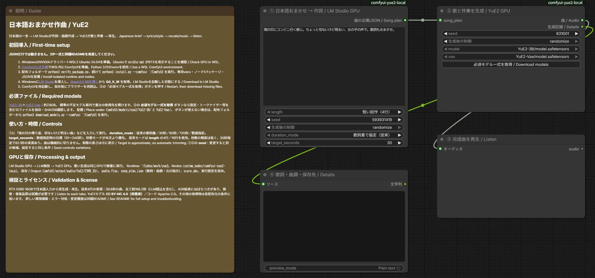

# 日本語でざっくり頼んで、RTX 5080で歌を作る。LM Studio × YuE2のComfyUIワークフロー


画像のワークフローと同じように、「こんな感じの曲がほしい」と日本語で書いて、あとはローカルのAIに任せたい。今回は、その入口をComfyUIに用意しました。

入力するのは、たとえばこんな一言です。

> 雨の日にコンビニ行く感じ。ちょっと切ないけど明るい、女の子の声で。歌詞もおまかせ。

LM StudioのQwen3.5 9Bがこの文章から歌詞と曲調を作り、YuE2が歌と伴奏を生成します。作詞モデルをGPUから解放してから曲生成へ進むので、同じRTX 5080を順番に使います。

試した環境では、4行の日本語歌詞から39.6秒の曲ができました。ComfyUIの実行開始から保存完了までは166.2秒。モデルの読み込みも含む時間です。ただし日本語の発音や歌詞の再現には確認が必要で、今回の結果を「毎回そのまま完成曲として使える」とは扱っていません。


この画像は実生成時の提供スクリーンショットです。現在の配布版では、時間の目標設定とモデル取得ボタンを追加しています。更新後の配置はこちらです。



## 最初に知っておいてほしいこと

扱うのは、リンク先の現在のYuE2-3Bです。旧YuE v1の導入記事とモデルを混ぜないでください。また、YuE2モデルはCC BY-NC 4.0、非商用の条件です。

YuE2単体でも日本語の歌詞・曲調で生成する実験は通りました。今回LLMを間に入れたのは、日本語が一切使えないからではなく、短く曖昧な依頼から歌詞や楽器・声・曲調まで補ってもらうためです。

以下は、これまでの[日本語LLMを使う動画ワークフロー記事](https://note.com/happy_duck780/n/n15e732b3147b)と同じく、配布物の中身、環境構築、モデル取得、操作、保存先の順で説明します。JSONだけでなく、導入スクリプトとカスタムノードを含むZIP一式を使ってください。

## 配布物と、別途必要なもの

|同梱物|用途|
|---|---|
|`workflows/*.json`|説明1枠＋実行ノードのComfyUIワークフロー|
|`custom_nodes/comfyui-yue2-local/`|カスタムノード1パッケージ。作詞・曲生成の2ノード|
|`runtime/`|LM Studio連携とYuE2子プロセスの実行コード|
|`install.py`|専用Python環境とノード、JSONの配置|
|`models.json` / `download_models.py`|13ファイルの固定取得先とSHA256確認付き取得|
|`verify_package.py` / `SHA256SUMS.json`|配布内容の欠落・変更・余分なファイル検出|
|`docs/note-article.md` / `assets/`|note用原稿、提供画像、サムネイル|

**JSONだけを読み込んでも動きません。** ZIPを全部展開して導入してください。モデル、LM Studio、ComfyUI、生成曲、APIキーは同梱していません。外部の有料APIキーは不要です。初回のソフト・モデル取得にはインターネット接続を使います。

## 動作確認した環境

- Windows＋WSL2 Ubuntu、NVIDIA GeForce RTX 5080 16GB。
- ComfyUIはWSL内の既存環境。YuE2だけPython 3.12.3の独立venv。
- YuE2側：PyTorch 2.10.0+cu128 / CUDA 12.8、sm_120対応を実機確認。
- LM Studio：Qwen3.5 9B Q4_K_M、GPU最大オフロード、コンテキスト4096。
- YuE2：非量子化YuE2-3B＋YuE2-Vae、公式コードの固定コミット。通常の32ステップ生成。独自のステップ削減は行っていません。

これは16GBで短い曲を生成できた実例です。すべての長さ・他GPUの動作を保証する最低要件ではありません。YuE2のモデル本体等で約7.8GBに加え、LLM・Python環境・ダウンロード用の空き容量が必要です。余裕を持って数十GBの空き容量を用意してください。

## 1. WindowsとWSLを準備

既にWSL内でComfyUIを使えている場合は、その環境を利用できます。既存ComfyUIのPythonやTorchをこの説明のために入れ替える必要はありません。

新規の場合はWindowsに[最新のNVIDIAドライバー](https://www.nvidia.com/Download/index.aspx)を入れ、[MicrosoftのWSL導入手順](https://learn.microsoft.com/windows/wsl/install)に従います。管理者PowerShellでのUbuntu 24.04導入例です。

```powershell
wsl --install -d Ubuntu-24.04
```

案内に従って再起動とUbuntuのユーザー作成を済ませます。以降、Linux用コマンドは**Ubuntuのターミナル**で実行します。WindowsのPowerShellへLinuxのコマンドをそのまま貼り付けないでください。

```bash
sudo apt update
sudo apt install -y git python3.12-venv libsndfile1 unzip
nvidia-smi
```

GPU名が表示されることを確認します。WSL内へ別のLinux用GPUドライバーを重ねて入れる手順ではありません。GPUが見えない状態なら、先にWindows側ドライバーとWSLの状態を確認してください。

## 2. WSL内にComfyUIを準備

既存環境があれば、その実際のフォルダーを以降の `--comfyui` に指定します。新規導入は[ComfyUI公式手順](https://docs.comfy.org/installation/manual_install)を参照してください。RTX 5080向けの作成例は以下です。`~/ComfyUI` が既に存在する場合、この新規作成例を重ねて実行しません。

```bash
cd ~
git clone https://github.com/Comfy-Org/ComfyUI.git
cd ~/ComfyUI
python3.12 -m venv .venv
.venv/bin/python -m pip install torch==2.10.0 torchvision torchaudio --index-url https://download.pytorch.org/whl/cu128
.venv/bin/python -m pip install -r requirements.txt
.venv/bin/python main.py --listen 127.0.0.1 --port 8188
```

Windowsのブラウザーで `http://127.0.0.1:8188` を開きます。既存ComfyUIでは普段の起動方法を維持してください。YuE2用ライブラリは次の独立venvへ入るため、ComfyUI本体のrequirementsへYuE2を追加する必要はありません。

## 3. 配布ZIPを展開し、YuE2を導入

ZIPはUbuntuから使える作業フォルダーへ展開します。例：`~/Codex/packages/` 配下。ZIP名は受け取った実ファイル名を指定します。

```bash
mkdir -p ~/Codex/packages
unzip /mnt/c/Users/Windowsのユーザー名/Downloads/受け取ったZIP名.zip -d ~/Codex/packages
```

展開されたフォルダーへ移動します。`README.md` と `install.py` が見える階層が正しい位置です。ブラウザーで編集中のワークフローを保存し、ComfyUIの実行キューが空の状態にしてから導入してください。

```bash
python3 verify_package.py
python3 install.py --comfyui ~/ComfyUI
```

インストーラーは公式YuE2ソースを固定コミットで取得し、`~/Codex/work/yue2/.venv` にPyTorchとYuE2を入れます。既存の異なるYuE2ソースへ勝手に上書きせず停止します。その場合は `--runtime ~/Codex/work/yue2-music` のように別フォルダーを指定できます。

配置結果：

```text
~/Codex/work/yue2/
  .venv/                  YuE2専用Python
  repo/                   固定した公式YuE2ソース
  planner.py / run_song.py
~/ComfyUI/
  custom_nodes/comfyui-yue2-local/__init__.py
  custom_nodes/comfyui-yue2-local/local_config.json
  user/default/workflows/03_音声/17_音楽_YuE2/
    YuE2_日本語おまかせ_LMStudio_GPU.json
  models/yue2/
```

ノードを手動コピーする場合もフォルダーの二重入れに注意してください。`custom_nodes/comfyui-yue2-local/comfyui-yue2-local/__init__.py` ではありません。専用環境の位置はインストーラーが `local_config.json` に記録します。

導入後はComfyUIを再起動し、保存済みワークフローをブラウザーで再読込します。

## 4. LM Studioと作詞モデルを準備

Windowsに[LM Studio](https://lmstudio.ai/download)をインストールして起動します。ワークフロー左の「Qwen3.5 9Bを開く」から[モデルページ](https://lmstudio.ai/models/qwen/qwen3.5-9b)へ進み、LM Studioで **Qwen3.5 9BのQ4_K_M** をダウンロードしてください。作詞側モデルはComfyUIのmodelsフォルダーへ入れません。

UbuntuからWindows側CLIが見えることを確認します。

```bash
cd ~/Codex/work/yue2
python3 -c "import planner; print(planner.cli('ls'))"
```

通常インストールのLM Studio CLIはWindowsのLocalAppDataから自動検出します。独自配置で見つからない場合のみ、ComfyUIを起動するUbuntuシェルで `YUE2_LMS_CLI` に実在する `lms.exe` のWSL形式パスを設定します。

```bash
export YUE2_LMS_CLI='/mnt/c/実際の配置先/lms.exe'
```

実行時にCLIで専用の `yue2-planner` としてモデルをロードし、作詞後にそのモデルだけをアンロードします。LM Studioは起動しておいてください。他の大きなモデルを手動ロードしたままだとVRAMが足りなくなることがあります。

接続先はWSLの既定ゲートウェイ側Windows、ポート1234です。APIが停止していればCLIで同アドレスへ起動します。WSLからWindowsへの接続が許可された構成を前提とし、インターネットへポートを公開する必要はありません。ミラーネットワーク、ポート変更、API認証必須構成はこの版の実機検証対象外です。接続できない場合はLM StudioのDeveloper画面とWindowsのファイアウォールを確認してください。

## 5. ワークフローからモデルを取得

左側のワークフロー一覧で `03_音声 → 17_音楽_YuE2` を開きます。②のモデル選択欄と `properties.models` に、公式の固定リビジョンの取得先を設定しています。不足モデルの案内から取得先を開ける、ComfyUIで一般的な形式です。

**重み2ファイルだけでは動きません。** 設定・トークナイザー・ライセンスを含む13ファイルが必要です。ComfyUIの版によってはブラウザーのDownloadsへ保存され、自動でWSLの正しいフォルダーへ配置されません。**②の「必須モデル一式を取得 / Download models」ボタン**なら、全13ファイルを所定位置へ保存し、サイズとSHA256も確認します。取得中は同じボタンに状態を表示します。失敗時にはエラーが表示され、未完了の `.part` は完成品として使われません。ボタンと同じ処理をUbuntuから実行する方法は次です。

```bash
python3 download_models.py --comfyui ~/ComfyUI
python3 download_models.py --comfyui ~/ComfyUI --check-only
```

必須配置：

```text
ComfyUI/models/yue2/
  YuE2-3B/
    model.safetensors
    config.json
    generation_config.json
    yue2_generation_config.json
    qwen.tiktoken
    weights_manifest.json
    LICENSE
    THIRD_PARTY_NOTICES.md
  YuE2-Vae/
    model.safetensors
    config.json
    weights_manifest.json
    LICENSE
    THIRD_PARTY_NOTICES.md
```

既存ファイルが正しければ再取得しません。内容不一致は上書きせずエラーになります。取得途中の `.part` は完成品として使いません。モデルの追加後はComfyUIを再起動またはモデル一覧を更新し、②で上記の2つの `model.safetensors` を選択してください。

## 6. 日本語で入力して生成

①に、例えば次を入力して「実行する」を押します。

> 雨の日にコンビニ行く感じ。ちょっと切ないけど明るい、女の子の声で。歌詞もおまかせ。

処理は「①作詞と曲調 → 作詞LLM解放 → ②YuE2生成 → ③再生」の順です。英語の曲調を書く必要はありません。④には歌詞・英語の曲調・実際の曲の秒数・保存先が表示されます。

|設定|意味|
|---|---|
|`brief`|日本語の希望。ジャンル、雰囲気、声、場面など|
|`length`|従来モードで使う歌詞量。短い試作4行／通常16行|
|`duration_mode`|従来の歌詞量、目標30／60／120秒（試験的）、数値指定|
|`target_seconds`|「秒数を指定（目安）」の時に使う10～240の整数|
|①`seed`|作詞候補を変える種|
|②`seed`|同じ歌詞・曲調から曲の候補を変える種|
|`model` / `vae`|取得済みYuE2-3B / YuE2-Vaeの重み|

時間は本文に「30秒くらい」と日本語で書くこともできます。ただし本文だけの秒数はLLMへの希望で、数値として検証する専用パーサーはありません。明確に渡したい場合はノードの時間設定を使います。ノードの秒数モードは本文より優先し、歌詞量と曲調への指示を調整します。

**時間設定は試験的で、精度は低いです。30秒指定でも62.1秒になった実測があります。** YuE2の通常リクエストには正確な出力秒数を固定する引数がありません。長い無音や歌の途中を切って指定秒数に合わせる処理も入れていません。完成尺が必須の用途では、完成曲を試聴してから別途編集してください。60／120秒・数値上限の実生成は未検証です。

## 出力先と記録

`ComfyUI/output/audio/YuE2/日時_ID/` へ保存します。主なファイルは `audio.flac`、`song_plan.json`、`score.abc`、`result.json` です。元の指示、生成歌詞・曲調、seedなどを残すため、別候補との比較に使えます。再生ノードの一時音声とは別に、完成音声をoutputへ保存します。

実行ログは専用環境の `jobs/` にあります。ログには入力した文章が含まれるため、公開配布へそのまま混ぜないでください。

## 実測と確認範囲

|条件|生成音声の長さ|全工程時間|
|---|---:|---:|
|日本語おまかせ、従来4行|39.5587秒|166.211秒|
|日本語おまかせ、目標30秒|62.1187秒|191.927秒|

全工程時間はComfyUIの実行開始から成功まで。LLMのロード、作詞、解放、YuE2のロードと生成、保存を含みます。成功した各1回の値で、前の失敗試行やモデルダウンロード時間は含みません。実行キャッシュによるノード省略はありません。従来4行のYuE2子プロセスのピークGPU確保量は約7.84GiB、予約量は約7.88GiBです。PC全体の最大VRAM値ではありません。

実際のComfyUIボタンから曲生成・ファイル保存を確認し、39.6秒音声はブラウザーの再生位置が進むことも確認しました。ASRでは日本語の冒頭が認識される一方、サビに歌詞との不一致がありました。歌唱側の違いと認識器の誤りをASRだけでは分けられないため、全歌詞の正確な歌唱や音楽品質の合格とは扱っていません。

日本語の曖昧な指示はLLMが具体的な歌詞と英語の曲調へ変換できました。またYuE2単体へ日本語の曲調と日本語歌詞を渡す実験でも生成は成功しています。「日本語は全く使えない」という結果ではありません。ただし、曖昧な要望をそのまま毎回意図通りに歌へ変換する能力の保証でもありません。[公式デモ](https://map-yue2.github.io/)にも日本語歌唱例があります。

## 困ったとき

|症状|確認する場所・対処|
|---|---|
|赤い未定義ノード|カスタムノードの配置階層とComfyUI起動ログを確認。配置後に本体再起動とブラウザー再読込|
|モデルがない／config・tokenizerがない|重みだけでなく13ファイルを取得し `download_models.py --check-only` で検査|
|CUDAが使えない／sm_120エラー|WSLの `nvidia-smi` とYuE2専用venvのTorchを確認。ComfyUI側と混同しない|
|LM Studio CLIがない|Windowsへ通常インストールして起動。独自配置なら `YUE2_LMS_CLI` を実パスで指定|
|モデルが見つからない|LM StudioでQwen3.5 9B Q4_K_Mの取得を完了。識別名 `qwen/qwen3.5-9b` を確認|
|接続拒否／タイムアウト|LM Studio Developer画面、ポート1234、WSLからWindowsへの通信を確認|
|VRAM不足|他の画像・動画・LLM処理を終え、短い試作で再実行|
|作詞が途中終了|曲生成は開始しません。ログとLM Studioのモデル設定を確認して再実行|
|中止がすぐ反映されない|YuE2子プロセスは停止処理あり。LM Studioのロード／API応答中は最大約180秒の待ちが残り得ます|
|秒数や歌詞が期待と違う|④と音声を確認。時間は目標、歌唱品質は候補ごとに試聴。seedで別候補を作成|

## バージョン管理と再構築

配布識別子は `VERSION`、変更点は `CHANGELOG.md` に記載しています。ソースはGitで管理し、改行変換を止める `.gitattributes` を設定しています。公開リポジトリを作成したことを意味するものではありません。

タグ付きソースからの構築：

```bash
python3 build_package.py --output /保存先フォルダー
```

生成ZIPを新規フォルダーへ展開し、その中で `python3 verify_package.py` を実行します。SHA256一覧はマニフェスト自身以外の全ファイルを対象とし、余分なファイルもエラーにします。確認後にPythonを実行すると `__pycache__` ができる場合があるため、配布原本の確認は導入前に行ってください。

## ライセンス・参照

連携コード：Apache-2.0。YuE2モデル：CC BY-NC 4.0。Qwen・LM Studio・ComfyUIは各配布元の条件に従います。詳細は `LICENSE` と `NOTICE.md`、取得した各モデル内のライセンスを参照してください。

- [YuE2公式ソース](https://github.com/multimodal-art-projection/YuE)
- [YuE2-3B](https://huggingface.co/m-a-p/YuE2-3B) / [YuE2-Vae](https://huggingface.co/m-a-p/YuE2-Vae)
- [LM StudioのQwen3.5 9Bページ](https://lmstudio.ai/models/qwen/qwen3.5-9b)
- [導入検討時の参考記事](https://note.com/humble_bobcat51/n/n977c99a109eb)
